# 摘要

智谱深度研究智能体（Zhipu Deep Research）是智谱北方交付中心面向 ToB/政企场景开发的端到端研究报告生产智能体。本报告以商业化落地为核心命题，系统回答"你是谁、解决什么问题、卖给谁、怎么卖、卖多少钱、如何试点"六大问题，为智谱北方交付中心将技术成果转化为可销售政企解决方案提供决策依据。

核心发现可概括为五条判断：

**第一，产品定位必须锚定"低频高价值"赛道。** 单份报告端到端耗时约 2 小时、推理成本 50–80 元，使产品天然不适用于高频轻量问答，但与人工研报成本 2–5 万元/份相比具备 100 倍以上成本替代优势。DeepResearch Bench I 排行榜第一名（57.06 分）为这一定位提供了独立第三方技术验证。

**第二，金融行业是首选突破口。** 在需求强度、付费意愿、决策链路、交付复杂度的四维交叉评估中，金融行业综合排名第一（P0）：IT 投入占营收 6%+，91% 要求本地化部署，试点转化率 58%（各行业最高），投资回收期约 5.8 个月。

**第三，差异化壁垒的核心不是"模型更强"，而是"品类不同"。** 将产品从"AI 写作工具"重新归入"AI 研究交付"品类，以私有化部署 + 信创适配为准入壁垒、DRB I 第一名 + 端到端闭环为能力壁垒、万字级定位 + 工作流嵌入为场景壁垒，构建三层递进护城河。

**第四，商业模式应走 RaaS（结果即服务）路线而非传统 SaaS 订阅。** 按报告计费（200–500 元/份）为验证形态，私有化一体机（150–500 万元/台）为利润形态，渠道 OEM/联合方案为规模杠杆，三阶段演进从验证到规模化。

**第五，商业化落地的首要切入点为"金融 × 投研报告 × SaaS 按报告计费 → 私有化一体机"组合。** 6 个月窗口内完成 3–5 家金融机构 MVP 试点、≥2 家续约、1 台一体机签约，ARR 达 500 万元以上。

报告共七章，逻辑递进：第 1 章界定产品定位与能力边界，第 2 章分层评估目标客户优先级，第 3 章识别高价值场景与需求映射，第 4 章分析竞品格局与差异化壁垒，第 5 章设计商业模式与定价策略，第 6 章制定销售策略与 MVP 试点方案，第 7 章收敛推荐切入点与六个月实施路线图。

# 第1章 产品定位与核心能力边界

## 1.1 产品定义：从技术概念到商业实体

智谱深度研究智能体（Zhipu Deep Research）是由智谱北方交付中心面向 ToB/政企场景开发的端到端研究报告生产智能体。其核心定位可概括为：**替代"研究型知识工作者"案头研究环节的 AI 数字员工**，而非通用问答工具或内容生成引擎。

学术界对"深度研究智能体"（Deep Research Agent, DR Agent）已有正式定义：由大语言模型驱动，集成动态推理、自适应规划、多轮外部数据检索与工具调用，以及结构化分析报告生成能力，用于信息研究任务的 AI 智能体 [DR Agent 综述](https://openreview.net/forum?id=FCRtTkjOvT "TMLR, 2025年11月")。智谱深度研究智能体正是在此框架下的工业级实现——它不是某一环节的效率工具，而是涵盖研究任务拆解、多源信息检索、交叉验证直至长篇结构化报告产出的完整闭环。

在产品谱系上，智谱深度研究智能体的底层技术架构继承自 AutoGLM 沉思版的三引擎体系：GLM-Z1-Air 推理引擎（200 token/s 吞吐）、Rumination 沉思引擎（递归推理与自我验证）和 Operator 执行引擎（200+ 工具 API 与真实浏览器交互）[知乎专栏](https://zhuanlan.zhihu.com/p/1916807356299347416 "2025年6月")。AutoGLM 沉思版于 2025 年 3 月在中关村论坛正式发布，定位为"全球首个集深度研究与实际操作能力于一体的 Agent"[智源社区](https://hub.baai.ac.cn/view/44555 "智谱发布首个具备深度研究和操作能力的AI Agent")；而智谱深度研究智能体则是将这一 C 端产品能力重新封装、加固并面向企业交付场景的专业化版本，由智谱北方交付中心负责商业化落地与客户交付。

## 1.2 它不是什么：三条边界线

界定产品的核心能力边界，与说明它能做什么同等重要。以下三条边界线将智谱深度研究智能体与市场上常见的 AI 产品形态清晰区分。

### 边界一：不是"问答升级版"，是研究任务闭环执行者

通用 AI 问答工具（包括 RAG 增强的 LLM with Search）的核心交互模式是"用户提问 → 模型检索片段 → 拼接回答"。DeepResearch Bench 评测数据清晰量化了两者差距：LLM with Search Tools 的 RACE 得分仅为 35–41 分，有效引用数 4–33 条；而 Deep Research Agent 的 RACE 得分达 47–49 分，有效引用数 31–111 条——尤其在引用数量和信息源覆盖深度上存在数量级差异 [DeepResearch Bench 官网](https://deepresearch-bench.github.io/ "Main Results 表格")。

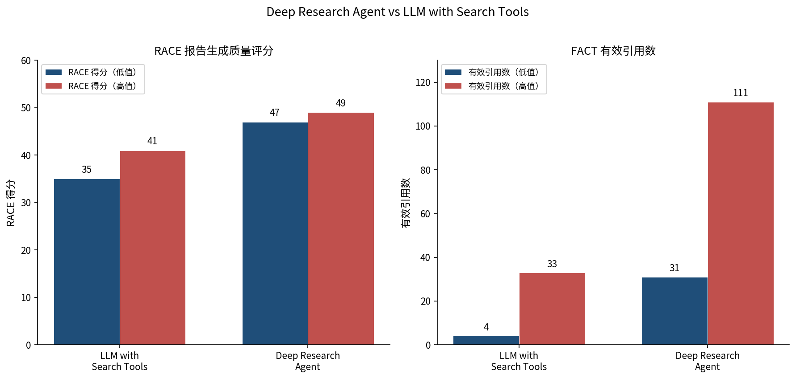
*图：Deep Research Agent 与 LLM with Search Tools 在 RACE 报告生成质量评分及 FACT 有效引用数上的对比*

造成这一差距的根本原因是架构层面的不同：问答工具执行"检索-拼接"，深度研究智能体执行"规划-检索-验证-综合-输出"的多轮闭环。后者需要自主拆解研究任务、规划检索策略、交叉验证不同来源的信息、识别矛盾与空白、并递归地补充检索——这是一个需要多步推理与自我纠错的复杂任务，而非单轮问答的简单放大。

### 边界二：不是"高频轻量"工具，是低频高价值研究引擎

智谱深度研究智能体的单份报告端到端耗时约 2 小时（Plan 阶段约 1 小时，Write 阶段约 1 小时），单份推理成本约 50–80 元。这一成本-耗时结构决定了其不适用于"几分钟内出一段摘要"或"实时监控舆情变化"等高频轻量场景。

行业主流竞品的端到端耗时分布为：OpenAI Deep Research 5–30 分钟、Gemini < 15 分钟、Perplexity 2–4 分钟、AutoGLM 标准报告 3–5 分钟 [Helicone](https://www.helicone.ai/blog/openai-deep-research "2025年评测")。智谱的"约 2 小时"耗时显著超过所有竞品，这一特性不应被简单视为劣势——它反映了产品定位的根本差异：**万字级深度研究报告场景**，而非分钟级快速摘要场景。

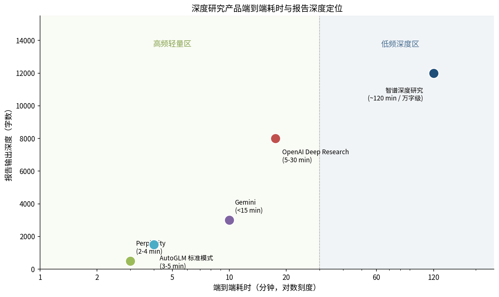
*图：主流深度研究产品在端到端耗时与报告输出深度二维空间中的定位分布*

在商业逻辑上，这意味着产品瞄准的不是"让每个人每天多用几次 AI"的市场，而是"让专业研究员用 AI 替代原本需要数天甚至数周的案头研究"的市场。后者的付费意愿和客单价远高于前者。

### 边界三：不是纯线上 SaaS，是可私有化部署的政企级解决方案

智谱 2024 年本地化部署收入占总营收的 84.5%[36氪/招股书](https://m.36kr.com/p/3628998562776324 "智谱业务结构")，这一数据本身就是产品定位的注脚。金融行业 91% 的生成式 AI 部署为本地化 [IDC报告](https://finance.sina.com.cn/stock/hkstock/hkstocknews/2025-06-17/doc-infaktwy2004204.shtml "IDC金融行业生成式AI市场份额，2024")，政务场景对一体机私有化部署为刚需 [民生证券AI+政务研报](https://pdf.dfcfw.com/pdf/H3_AP202504261662908517_1.pdf "AI+政务研报，2025年4月")——在这些核心客群中，能否私有化部署不是加分项，而是入场券。

智谱深度研究智能体具备真实浏览器交互能力，可突破模拟浏览的局限，实现对 CNKI、小红书、微信公众号等需认证平台的访问 [DR Agent 综述中文版](https://www.cnblogs.com/emergence/p/18956327 "博客园")。在私有化部署环境下，这一能力可进一步扩展至企业内网知识库、内部数据库等非公开信息源，构成端到端闭环的关键一环。

## 1.3 技术能力图谱：五项核心能力的量化刻画

智谱深度研究智能体的技术能力可拆解为五个维度，每个维度均有可量化的锚点。

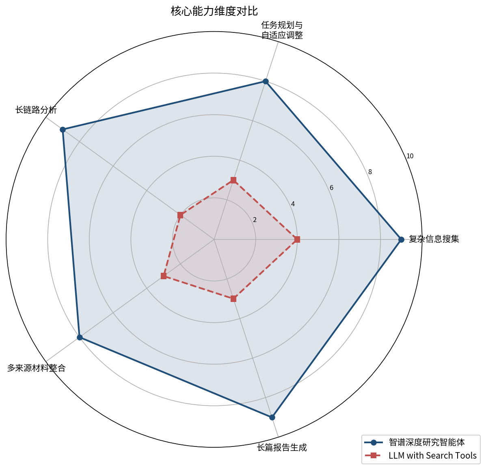
*图：智谱深度研究智能体与 LLM with Search Tools 在五项核心能力维度上的对比*

### 能力一：复杂信息搜集

基于 Operator 执行引擎的真实浏览器交互，智能体可在开放网络环境中自主导航，访问需要登录、认证或动态渲染的信息源（如 CNKI 学术数据库、微信公众号、小红书等）。当前支持 200+ 工具 API 调用 [知乎专栏](https://zhuanlan.zhihu.com/p/1916807356299347416 "2025年6月")，覆盖学术文献、行业报告、新闻资讯、政府公告等多类信息源。

DeepResearch Bench 评测中，智谱深度研究在 FACT 维度的有效引用数显著领先于 LLM with Search 方案（31–111 条 vs 4–33 条）[DeepResearch Bench 官网](https://deepresearch-bench.github.io/ "Main Results 表格")，直接反映了信息搜集的广度与深度差异。

### 能力二：任务规划与自适应调整

Rumination 沉思引擎实现了递归推理与自我验证机制：智能体在执行研究任务的过程中，能够根据已获取信息动态调整检索策略，识别信息缺口并主动补充，而非机械执行预设流程。这一能力在 DeepResearch Bench 的 RACE 评测中"全面性"和"洞察力"维度得到体现——总分 57.06 分意味着生成的报告在信息覆盖的完整性和分析深度上均达到较高水平 [DeepResearch Bench GitHub](https://github.com/Ayanami0730/deep_research_bench "2026年5月7日排行榜")。

### 能力三：长链路分析

端到端约 2 小时的研究流程中，Plan 阶段约占 1 小时。这一时间分配表明智能体在规划阶段投入了显著的推理算力，用于任务拆解、检索策略设计和信息缺口预判——而非简单的"先搜再写"两步走。长链路分析能力使智能体能够处理需要跨领域综合、多轮交叉验证的复杂研究课题，而非仅完成单域信息汇总。

### 能力四：多来源材料整合

DeepResearch Bench 的 FACT 维度专门评估引用准确性和有效引用数。智谱在 DRB I 排行榜以总分 57.06 排名第一 [DeepResearch Bench GitHub](https://github.com/Ayanami0730/deep_research_bench "2026年5月7日排行榜")，这一成绩建立在有效的多来源整合能力之上——即从数十至上百条引用中提取关键信息、识别信息间的关联与矛盾，并以逻辑连贯的方式组织到报告中。

### 能力五：长篇报告生成

产品的输出形态为万字级结构化研究报告，而非简短回答或信息摘要。Write 阶段约 1 小时的耗时投入，确保了报告在结构完整性、论证深度和语言质量上的专业水准。当前市面上的竞品大多聚焦于 3–30 分钟的快速报告输出 [Helicone](https://www.helicone.ai/blog/openai-deep-research "2025年评测")，万字级深度报告赛道尚无直接竞品。

## 1.4 可信度锚点：DeepResearch Bench 第一名

DeepResearch Bench（DRB）由中国科学技术大学杜明轩、许本峰等研究者与北京元石科技合作开发，于 2025 年 6 月在 arXiv 发表论文。DRB 包含 100 个博士级研究任务（中英文各 50 条），覆盖 22 个学科领域，是当前深度研究智能体领域最具系统性的评测基准 [DeepResearch Bench 论文](https://arxiv.org/abs/2506.11763 "arXiv:2506.11763, 2025年6月")。

DRB 采用两套互补评测框架：RACE 评估报告生成质量（全面性、洞察力、指令遵循度、可读性），FACT 评估信息检索和引用准确性（引用准确率、有效引用数）[DeepResearch Bench 官网](https://deepresearch-bench.github.io/ "评测框架详情")。这一双维度设计确保评测结果既反映输出质量，又验证信息溯源能力——后者恰是政企客户在"可信度"维度的核心关切。

2026 年 5 月 7 日，智谱深度研究在 DRB I 排行榜以总分 57.06 排名第一，超越华为 Xiaoyi DeepResearch（57.00）、Cellcog Max（56.67）、1688AILab（56.53）及南大&阿里团队（56.04）[DeepResearch Bench GitHub](https://github.com/Ayanami0730/deep_research_bench "2026年5月7日排行榜")。这一成绩为产品的技术可信度提供了独立第三方验证。

需要客观说明的是，DRB II 排行榜上华为 Xiaoyi 以 58.72 排名第一，中国移动、NVIDIA 分列其后，OpenAI 排名第五（45.40）；智谱暂未提交 DRB II 成绩 [DRB II 官网](https://agentresearchlab.com/benchmarks/deepresearch-bench-ii/index.html "DRB II 排行榜")。这意味着智谱当前的可信度锚点集中在 DRB I 维度，DRB II 成绩的缺失在一定程度上限制了跨赛道全面领先的叙事，但也为后续成绩提交留出了增量空间。

## 1.5 能力边界声明：诚实的局限性

商业化方案的基础是对产品能力的诚实评估。以下局限性应在销售与交付过程中主动披露。

**时效约束**：单份报告约 2 小时的端到端耗时，使产品不适合对实时性要求极高的场景（如实时舆情监控、日内快速竞品追踪）。在产品叙事中，宜将"耗时"重构为"深度投资"——目标客户群本身即以"天"乃至"周"为单位规划研究项目。

**成本约束**：单份报告推理成本约 50–80 元，显著高于百度千帆（2.5 元/次调用）等轻量级方案 [百度千帆社区](https://qianfan.cloud.baidu.com/qianfandev/topic/687830 "定价信息")。但与人工研究员成本（券商研报约 2–5 万元/份 [同花顺案例](https://field.10jqka.com.cn/20260423/c676214240.shtml "头部券商文档解析私有化部署案例，2026年4月")）相比，AI 报告成本仅为人工的 1/250–1/1000，成本锚点应建立在"替代人工"而非"替代轻量 AI 工具"上。

**知识时效与幻觉风险**：尽管智能体具备实时检索能力，大语言模型的内在幻觉问题尚未根本解决。在金融、法律、医疗等容错率极低的场景中，AI 生成内容仍需人工审核 [证券时报](https://epaper.stcn.com/att/202503/25/8ab70a79-72cc-4a66-ae3e-0b0ef0d6caa3.pdf "AI渐成券商投研重要角色，2025年3月")。产品应定位为"研究初稿生产引擎"而非"最终决策引擎"，强调人机协作而非人机替代。

**私有化部署性能折损**：企业内网环境的算力约束可能导致推理速度与报告质量的折损，具体折损幅度取决于客户硬件配置。交付方案中应提供明确的硬件配置基线与性能承诺。

## 1.6 定位收敛：一句话产品定位

综合以上分析，智谱深度研究智能体的定位收敛为：

**面向政企的万字级深度研究报告生产引擎——在博士级研究任务评测中排名第一，以约 2 小时端到端闭环替代数天人工案头研究，支持私有化部署与信创适配。**

这一定位包含四个不可分割的要素：(1) 目标市场为政企（而非 C 端或 SMB）；(2) 输出形态为万字级深度报告（而非分钟级摘要）；(3) 技术验证为 DRB I 第一名（而非泛化的"AI 能力强"）；(4) 部署方式包含私有化（而非纯 SaaS）。四个要素中的任何一个被剥离，定位都会滑向不同的竞争赛道——而那些赛道上已有更成熟或更低价的竞争者。

# 第2章 目标客户分层与优先级判断

上一章界定了智谱深度研究智能体的产品定位——端到端博士级研究智能体，而非通用问答升级版。本章回答"卖给谁"：对六大目标客群进行需求强度、付费意愿、决策链路、交付复杂度的交叉分析，输出优先级排序与各客群典型画像。

## 2.1 评估框架：四维交叉模型

判断客群优先级不能仅看市场规模，而需在四个维度上进行交叉评估：

- **需求强度**：该客群是否存在高质量、低频、长链路研究的刚需？人工研究成本是否足够高，使 AI 替代具有显著经济价值？
- **付费意愿**：该客群是否已建立为"研究/洞察/分析"单独付费的习惯？AI 预算是否独立且可持续？
- **决策链路**：从接触到签约需要经过多少层级、多少时间？决策链路越短，试错成本越低。
- **交付复杂度**：是否要求私有化部署、信创适配、定制集成？交付复杂度直接影响首单交付成本与毛利。

基于此框架，六大客群的量化评估如下表所示。为更直观地呈现四维差异，下图以雷达图形式展示了各客群的综合优先级特征：

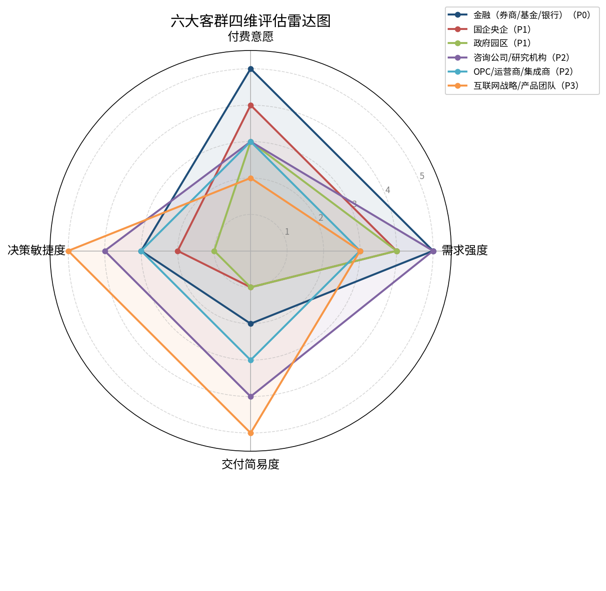

| 客群 | 需求强度 | 付费意愿 | 决策链路 | 交付复杂度 | 综合优先级 |
|------|---------|---------|---------|-----------|-----------|
| 金融（券商/基金/银行） | ★★★★★ | ★★★★★ | ★★★ | ★★★★ | **P0** |
| 国企央企 | ★★★★ | ★★★★ | ★★ | ★★★★★ | **P1** |
| 政府园区 | ★★★★ | ★★★ | ★ | ★★★★★ | **P1** |
| 咨询公司/研究机构 | ★★★★★ | ★★★ | ★★★★ | ★★ | **P2** |
| OPC/运营商/集成商 | ★★★ | ★★★ | ★★★ | ★★★ | **P2** |
| 互联网战略/产品团队 | ★★★ | ★★ | ★★★★★ | ★ | **P3** |

## 2.2 P0 客群：金融行业（券商/基金/银行）

### 2.2.1 需求强度：最高

金融行业对深度研究的需求由三个结构性因素驱动。其一，投研报告是机构核心生产资料——券商研报人工成本约 2–5 万元/份，定制研报定价 5–100 万元/份，AI 替代的经济价值极为显著[同花顺案例](https://field.10jqka.com.cn/20260423/c676214240.shtml "头部券商文档解析私有化部署案例，2026年4月")。其二，AI 投研渗透率将从 2023 年 18% 提升至 2030 年 75%，智能投研平台预计覆盖 80% 以上机构客户[东方财富](https://caifuhao.eastmoney.com/news/20260109072720074531210 "中国精品投行领域2025年发展现状及趋势")。其三，头部机构已率先落地——中信证券"超级研究员"可在几分钟内完成八九万字趋势报告，18 个数字员工累计处理 5000 万次请求[财联社](https://www.cls.cn/detail/2198606 "中信证券AI数字员工团队，2025年11月")，为行业需求的存在提供了实践验证。

### 2.2.2 付费意愿：最强

2024 年中国金融行业生成式 AI 市场规模约 9.14 亿元，IDC 预测 2027 年将升至 35.09 亿元（增幅 384%）；其中 91% 为本地化部署[IDC 报告](https://finance.sina.com.cn/stock/hkstock/hkstocknews/2025-06-17/doc-infaktwy2004204.shtml "IDC金融行业生成式AI市场份额，2024")。2025 年 22 家上市券商合计 IT 投入约 219 亿元（占营收 6.05%），国泰海通、华泰证券均提出"ALL IN AI"战略[每日经济新闻](https://www.nbd.com.cn/articles/2026-04-17/4343766.html "2025年券商年报IT投入统计")。金融行业 IT 投入占营收比例在各行业中位居前列，且 91% 的本地化部署比例意味着客户已为"安全合规 + 高价值"支付溢价。

### 2.2.3 决策链路：中等

金融行业 AI 采购决策通常在 3–6 个月内完成，由 IT 部门与业务部门（投研/风控）共同决策。2025 年金融大模型中标项目量同比增长 341%，金额同比增长 527%，应用类项目金额集中在 30–150 万元[中国经营报/艾瑞咨询](https://news.qq.com/rain/a/20260209A03D5G00 "金融大模型招投标分析，2026年2月")——项目规模适中、决策周期可控。

### 2.2.4 交付复杂度：高但可控

金融行业 91% 本地化部署要求意味着一体机/私有化方案为刚需，但这也是产品差异化的核心壁垒来源。券商 AI 投研三大核心挑战——幻觉问题（容错率极低）、私有化部署算力有限、API 调用响应速度瓶颈[证券时报](https://epaper.stcn.com/att/202503/25/8ab70a79-72cc-4a66-ae3e-0b0ef0d6caa3.pdf "AI渐成券商投研重要角色，2025年3月")——恰好对应深度研究智能体"多源验证 + 本地化 + 端到端闭环"的能力结构。

### 2.2.5 典型画像

- **核心决策者**：券商/基金 CIO 或投研总监，年度 AI 预算 100–500 万元
- **核心诉求**：降低投研人力成本、提升报告产出效率、确保数据不出域
- **现有替代方案**：Wind/Bloomberg 数据终端 + 人工研究员 + 简单 RAG 工具
- **关键 Objection**：幻觉风险、信创合规、与现有投研中台集成难度

## 2.3 P1 客群：国企央企

### 2.3.1 需求强度：高且具政策驱动性

央企数智化市场 2024 年达 3670 亿元，AI 应用市场 2025 年预计 440 亿元（同比 +40%）；但 25% 央企仍处基础筹备阶段，40% 处于非核心业务智能化[央国企 AI 数智化转型白皮书](https://www.ageclub.net/article-detail/7823 "央企数智化转型市场规模，2025")。央企考核机制已将数字化转型纳入 KPI，"数据资产增值率"权重占比达 15%，部分能源集团按营收 3% 计提数字化转型专项资金[科学网](https://wap.sciencenet.cn/blog-3525898-1490721.html?mobile=1 "十五五央企数字化转型战略规划研究")。国企"十五五"规划外部咨询费分层明显：国际顶级 500–2000 万元，国内一线 200–800 万元，第三方行业报告 5–20 万元/份[知乎/行业分析](https://zhuanlan.zhihu.com/p/27508266656 "国企编制十五五规划费用分析，2026年")。在"第三方行业报告"这一层级，深度研究智能体具备直接替代价值。

### 2.3.2 付费意愿：高但流程刚性

央企预算确定性高——数字化转型为刚性考核项，资金来源明确。但采购流程受国资监管约束，通常需招投标、供应商入围，决策周期 6–12 个月。付费意愿受政策驱动多于经济理性，但一旦立项则预算刚性，不易削减。

### 2.3.3 决策链路：最长

央国企 AI 采购涉及业务部门、IT 部门、采购部门、合规/信创审核、分管领导等多层级审批，决策链路为六大客群中最长。首单落地周期虽长，但一旦建立供应商资格，后续复购具有持续性。

### 2.3.4 交付复杂度：最高

央国企对信创/国产化的要求为硬性约束，需适配鲲鹏/昇腾/海光等信创芯片及统信/麒麟等操作系统。一体机方案（150–500 万元/台）为典型交付形态[头豹研究院](https://www.fxbaogao.com/detail/4952520 "大模型一体机行业研究")。交付复杂度虽高，但一体机方案的客单价和毛利空间也最高。

### 2.3.5 典型画像

- **核心决策者**：集团数字化转型办公室/信息中心负责人，年度 AI 预算 500–2000 万元
- **核心诉求**：满足考核指标、降本增效、战略研究报告自动化、信创合规
- **现有替代方案**：外部咨询公司 + 内部研究部门 + 通用大模型对话
- **关键 Objection**：信创适配是否完成、数据安全合规、是否属于"核心业务"智能化

## 2.4 P1 客群：政府园区

### 2.4.1 需求强度：高且场景明确

中国公共采购 2023 年总额超 46 万亿元，数字政府投资中大数据占 28%、AI 占 18%[民生证券 AI+政务研报](https://pdf.dfcfw.com/pdf/H3_AP202504261662908517_1.pdf "AI+政务研报，2025年4月")。国务院 2025 年 8 月印发意见，要求到 2027 年智能体应用普及率超 70%、2030 年超 90%[东方财富/中国经营网](https://wap.eastmoney.com/a/202512133590541696.html "三大运营商竞逐智能体报道")。深圳福田区 70 名 AI 数智员工覆盖 240 个政务场景，公文审核缩短 90%，分拨准确率从 70% 提升至 95%[深圳市政府官网](https://www.sz.gov.cn/cn/xxgk/zfxxgj/gqdt/content/post_12006997.html "福田区AI数智员工，2025年2月")。政策研究、产业分析、招商引资报告构成深度研究智能体的直接应用场景。

### 2.4.2 付费意愿：中等偏上

政府 AI 采购预算受财政年度约束，金额确定性高但灵活性低。深圳光明区商务局产业研究经费 78 万元/年[光明区预算](https://www.szgm.gov.cn/gmswj/attachment/1/1567/1567683/12112320.pdf "2025年光明区商务局部门预算")，单部门年度研究经费在 50–100 万元量级。AI 一体机私有化部署为政务刚需[民生证券](https://pdf.dfcfw.com/pdf/H3_AP202504261662908517_1.pdf "AI+政务研报")，但采购决策受政策窗口期影响较大。

### 2.4.3 决策链路：最长且受政策窗口约束

政府园区 AI 采购需经部门申报、财政审批、政府采购流程，决策周期 6–18 个月，且受年度预算编制周期约束（通常 9–12 月编制下一年度预算）。窗口期错配将导致整个年度机会丧失。

### 2.4.4 交付复杂度：最高

政府场景的交付复杂度与央国企相似——信创适配为硬性要求，数据安全等级保护（等保 2.0/3.0）为强制门槛。政务数据接入还需跨部门协调，进一步增加交付难度。

### 2.4.5 典型画像

- **核心决策者**：园区管委会主任/经信局分管领导，年度 AI 预算 100–500 万元
- **核心诉求**：产业研究报告自动化、招商引资企业画像、政策对比分析、数据安全合规
- **现有替代方案**：第三方产业研究机构 + 内部统计部门 + 通用办公 AI
- **关键 Objection**：等保合规、数据归属权、是否可纳入"数字经济"专项预算

## 2.5 P2 客群：咨询公司/研究机构

### 2.5.1 需求强度：最高但替代敏感

全球 AI 咨询市场 2026 年将达 141 亿美元，预计 2035 年超 1168 亿美元（CAGR 26.49%）[Business Research Insights](https://www.businessresearchinsights.com/zh/market-reports/artificial-intelligence-ai-consulting-market-109569 "AI咨询市场规模预测")。MBB 中型项目 8 周约 120 万美元，Associate 日费 6000 美元、Partner 超 10000 美元[Case Interview Hub](https://www.caseinterviewhub.com/post/cost-mckinsey-consulting-project "McKinsey咨询项目实际成本，2026年4月")。案头研究占项目总工时 30%–50%，是 AI 替代价值最高的环节；McKinsey/BCG/Bain 单页 PPT 成本约 5000 美元[LinkedIn 分析](https://www.linkedin.com/posts/danielxli_5000-for-a-slide-we-analyzed-the-cost-activity-7384288221486055424-y4gB "咨询单页成本分析，2025年")。

然而，咨询公司的核心商业模式为"按人天计费"，AI 替代人力可能侵蚀其收入基础。需求强度与付费意愿之间存在结构性张力：咨询公司对"提升效率"的 AI 工具有需求，但对"替代分析师"的 AI 工具有天然抵触。

### 2.5.2 付费意愿：中等

咨询公司愿意为提升分析师效率的工具付费，但通常以"内部工具"而非"客户交付物"的预算口径进行采购。国内中小型咨询/研究机构付费能力有限，对开源/低成本方案更敏感。四大的 AI 工具采购决策更趋保守，但一旦采用则规模可观。

### 2.5.3 决策链路：较短

咨询公司/研究机构的决策链路相对较短，通常由知识管理负责人或技术合伙人决策，2–4 周可完成试点评估，2–3 个月可签约。这一特征使其成为理想的早期验证客户。

### 2.5.4 交付复杂度：低

咨询公司通常接受 SaaS/API 接入方式，不要求私有化部署。交付复杂度为六大客群中最低。

### 2.5.5 典型画像

- **核心决策者**：知识管理总监/技术合伙人，年度 AI 工具预算 50–200 万元
- **核心诉求**：缩短案头研究周期、提升基础报告质量、释放分析师精力聚焦高价值判断
- **现有替代方案**：内部数据库 + 人工搜索 + 通用 AI 对话
- **关键 Objection**：是否会"替代"而非"辅助"分析师、报告质量控制、客户是否接受 AI 辅助产出

## 2.6 P2 客群：OPC/运营商/集成商

### 2.6.1 需求强度：中等但具渠道杠杆

运营商/集成商本身并非深度研究的终端消费者，但其掌握政企客户渠道与项目交付能力。中国移动灵犀智能体用户突破 2 亿，中国电信星辰平台已上线 5 万+智能体[中国移动官网](https://www.10086.cn/aboutus/news/groupnews/index_detail_53561.html "中国移动AI+战略，2025年")，运营商已具备 AI 智能体的分发能力。运营商政企业务毛利率同比下降 2.1 个百分点[电子工程专辑](https://www.eet-china.com/mp/a449672.html "运营商发展遇冷分析，2025年")，急需将 AI 能力嵌入行业应用以实现利润提升。

### 2.6.2 付费意愿：中等

运营商/集成商的付费意愿取决于能否将 AI 能力包装成增值服务向政企客户二次销售。其利润模型为"采购成本 + 集成溢价 + 运维年费"，对上游 AI 供应商的采购价敏感度中等。中国移动九天 DeepInsight 在 DRB II 排名第三（55.39），已具备自研能力[中国移动官网](https://www.10086.cn/aboutus/news/groupnews/index_detail_54689.html "九天DeepInsight成绩")，既是潜在渠道伙伴，也是竞合关系。

### 2.6.3 决策链路：中等

运营商/集成商的 AI 采购决策涉及技术评估、商务谈判、生态合作审批，周期约 3–6 个月。但一旦建立合作框架，后续项目复制速度快。

### 2.6.4 交付复杂度：中等

运营商/集成商具备自有交付团队，对上游供应商的交付要求主要为 API/SDK 接口规范与技术文档完备性。与金融/央国企的私有化部署相比，交付复杂度显著降低。

### 2.6.5 典型画像

- **核心决策者**：政企事业部创新业务负责人/AI 产品总监，年度 AI 生态合作预算 500–2000 万元
- **核心诉求**：丰富政企解决方案产品矩阵、提升项目客单价、差异化竞标能力
- **现有替代方案**：自研 AI 能力 + 其他大模型厂商 API
- **关键 Objection**：与自研产品线是否冲突、技术依赖风险、分成比例

## 2.7 P3 客群：互联网战略/产品团队

### 2.7.1 需求强度：中等

互联网行业 AI 渗透率 92% 居各行业首位[亿欧智库](https://www.iyiou.com/research/202601201649 "2025全球人工智能技术应用洞察报告")，但深度研究需求在互联网公司内部并非核心业务场景。竞品分析、市场趋势追踪、产品战略研究虽有需求，但频次低、替代方案多（内部数据团队 + 外部咨询 + 通用 AI 工具），且单个场景的预算规模有限。

### 2.7.2 付费意愿：最低

互联网行业 Chatbot 免费化趋势下，付费订阅在国内难以跑通[亿欧智库](https://www.iyiou.com/research/202601201649 "2025全球人工智能技术应用洞察报告")，AI 商业模式正向 RaaS（结果即服务）转型[智源社区](https://hub.baai.ac.cn/view/45734 "AI RaaS模式分析，2025年5月")。互联网公司更倾向于自建或使用开源方案，对外部 AI 工具的付费意愿极低。决策虽快（1–2 周），但预算规模小且持续性差。

### 2.7.3 决策链路：最短

互联网团队决策链路为六大客群中最短，通常由团队负责人直接决策，1–2 周可完成评估。但决策快也意味着切换成本低、客户忠诚度低。

### 2.7.4 交付复杂度：最低

互联网团队对私有化部署无硬性要求，SaaS/API 接入即可。交付复杂度最低，但这也意味着竞争壁垒最低、替代成本趋近于零。

### 2.7.5 典型画像

- **核心决策者**：战略分析总监/产品 VP，年度 AI 工具预算 10–50 万元
- **核心诉求**：竞品分析效率提升、行业趋势快速扫描、产品决策辅助
- **现有替代方案**：内部数据平台 + Perplexity/Claude 等通用 AI + 外部咨询
- **关键 Objection**：能否比现有工具强出数量级、数据安全（竞品信息敏感）、性价比

## 2.8 优先级排序的核心逻辑

综合四维评估，优先级排序的核心逻辑可归纳为三条原则：

**原则一：付费意愿与需求强度的乘积决定市场吸引力。** 金融行业在两个维度上均为最高（IT 投入占营收 6%+，91% 本地化部署），乘积最大；互联网虽需求中等但付费意愿最低，乘积最小。央国企/政府园区的需求强度和付费意愿均高，但被决策链路长度拉低综合得分。

**原则二：决策链路长度决定首单落地速度。** 智谱北方交付中心作为商业化初期团队，首单落地速度是生存关键。金融行业 3–6 个月、咨询公司 2–3 个月的决策周期，显著优于央国企/政府的 6–18 个月。因此金融定为 P0，央国企/政府定为 P1（预算确定性高但需更长时间孵化），咨询公司/运营商定为 P2（决策快但规模与持续性待验证）。

**原则三：交付复杂度与壁垒构建互为表里。** 金融/央国企/政府的高交付复杂度（私有化、信创、等保）对初创团队是挑战，但同时也是壁垒——一旦交付成功，竞品替换成本极高。互联网的低交付复杂度反而意味着低壁垒，不利于长期商业价值。

## 2.9 客群优先级与策略映射

| 优先级 | 客群 | 核心策略 | 目标客单价区间 | 预期决策周期 |
|--------|------|---------|--------------|-------------|
| P0 | 金融 | 直销突破，以投研报告场景切入，SaaS + 一体机双轨 | 30–500 万元 | 3–6 个月 |
| P1 | 国企央企 | 生态合作 + 招投标入围，以战略研究/行业报告场景切入 | 150–500 万元（一体机） | 6–12 个月 |
| P1 | 政府园区 | 政策窗口期卡位，以产业研究/招商引资场景切入 | 100–300 万元 | 6–18 个月 |
| P2 | 咨询/研究机构 | 效率工具定位，SaaS/API 接入，以案头研究辅助切入 | 50–200 万元/年 | 2–3 个月 |
| P2 | 运营商/集成商 | 渠道合作/OEM 授权，以解决方案组件切入 | 按项目分成 | 3–6 个月 |
| P3 | 互联网 | 低优先级，可作为技术验证和口碑传播渠道 | 10–50 万元/年 | 1–2 个月 |

下图以双轴组合图的形式，将各客群的目标客单价区间与预期决策周期并置呈现，直观揭示了"高客单价 + 长决策周期"与"低客单价 + 短决策周期"两类客群分布特征：

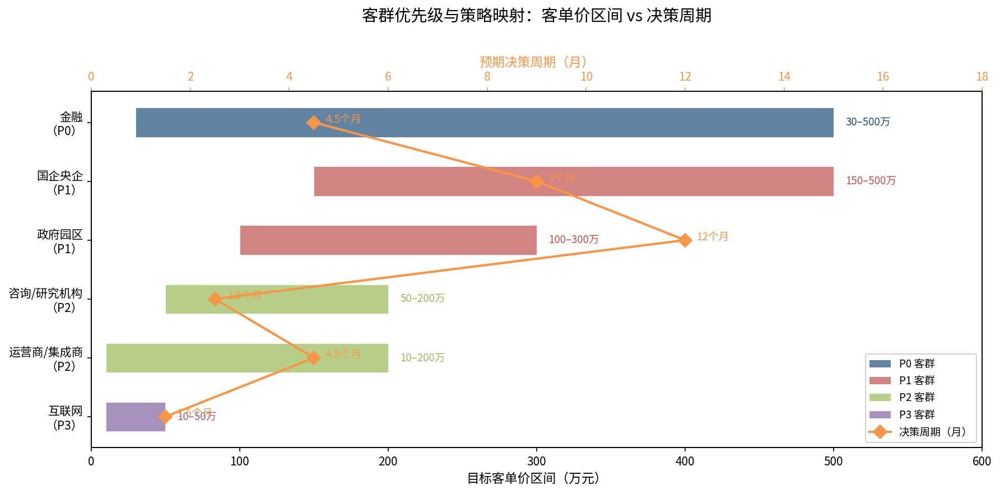

# 第3章 高价值场景识别与需求映射

上一章完成了目标客群的分层与优先级判断，确立了金融行业为首选、央国企与政府园区为第二梯队的基本格局。本章在此基础上进一步下沉至"具体什么场景愿意付费"，逐客群提炼高价值应用场景，明确每个场景的痛点、现有替代方案的不足，以及智谱深度研究智能体的差异化价值点，并在章末以场景矩阵和产品形态映射进行收敛。

## 3.1 高价值场景的识别框架

并非所有研究类工作都构成付费场景。判断一个场景是否具备"高价值"属性，需同时满足以下四个条件：

- **痛点足够重**：现有方案存在显著的时间、成本或质量瓶颈，客户对此有明确感知；
- **替代方案不足**：现有工具（通用问答、RAG 检索、人工搜索）无法有效覆盖该场景的核心需求；
- **结果可量化**：场景的产出物（报告、分析、洞察）可被明确定义和验收，使"按结果计费"具备可行性；
- **付费逻辑成立**：客户当前在该场景上已有明确的支出（人力、外包、咨询费），AI 替代或增强后能够实现可衡量的成本节约或效率提升。

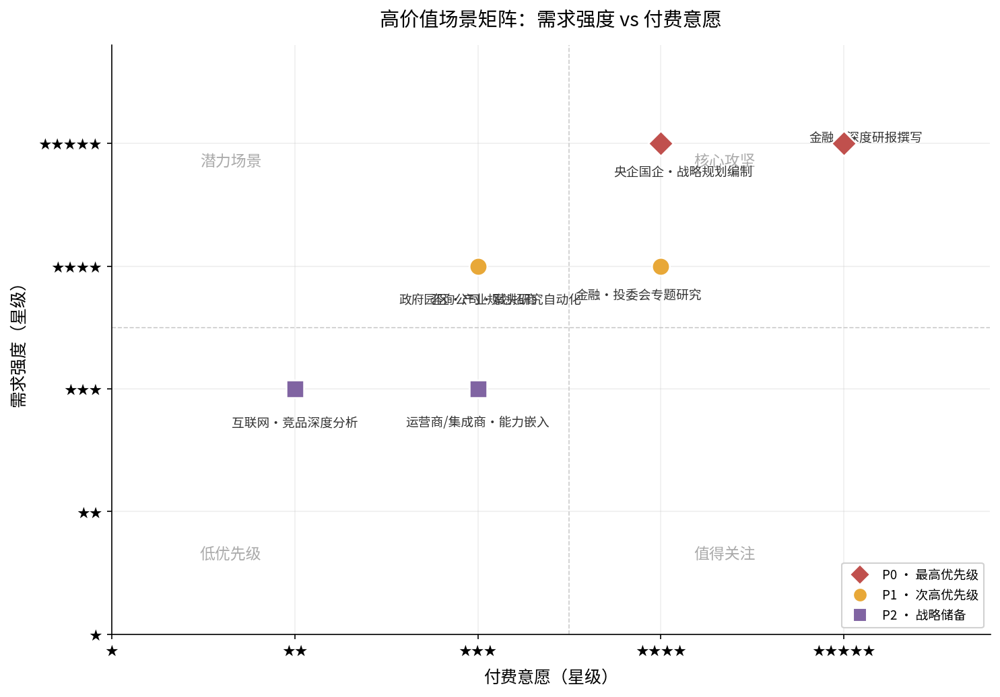

上图将四大客群的七个核心场景按"需求强度"与"付费意愿"两个维度映射至四象限矩阵。两个 P0 场景——金融深度研报撰写与央企国企战略规划编制——均落在"核心攻坚"象限，兼具高需求强度与高付费意愿，构成商业化优先突破方向。以下按客群逐一展开，对每个场景进行结构化映射。

## 3.2 金融行业：投研报告生产的效率革命

金融行业是付费意愿最强、场景成熟度最高的目标客群。2024 年中国金融行业生成式 AI 市场规模约 9.14 亿元，IDC 预测 2027 年将升至 35.09 亿元，其中 91% 为本地化部署 [IDC 报告](https://finance.sina.com.cn/stock/hkstock/hkstocknews/2025-06-17/doc-infaktwy2004204.shtml "金融行业生成式AI市场份额，2024")。行业内部对 AI 投研的投入持续加码：2025 年 22 家上市券商合计 IT 投入约 219 亿元（占营收 6.05%），国泰海通、华泰证券均提出"ALL IN AI"战略 [每日经济新闻](https://www.nbd.com.cn/articles/2026-04-17/4343766.html "2025年券商年报IT投入统计")。

### 场景一：行业深度研究报告撰写

**痛点**：券商深度报告是分析师最正式、最全面的分析产出，需阅读大量材料（包括几百页的招股说明书、相关书籍、各类网站数据），与公司及行业专家交流，最终形成逻辑清晰、有洞察力的万字级报告。即使是专心撰写，深度报告也需 1–2 周完成，而分析师白天已被路演、调研和公告跟踪占满，只能在周六和少数无公告的夜间集中撰写 [知乎专栏](https://zhuanlan.zhihu.com/p/407455566 "券商分析师工作状态与工作强度，2021年")。券商研报人力成本约 2–5 万元/份，定制研报定价 5–100 万元/份；人工处理常规研报 3–4 小时、复杂研报 6–8 小时 [同花顺案例](https://field.10jqka.com.cn/20260423/c676214240.shtml "头部券商文档解析私有化部署案例，2026年4月")。

**现有替代方案的不足**：通用 AI 问答工具生成的报告缺乏多源交叉验证，引用质量低下——DRB 评测显示 LLM with Search Tools 的有效引用数仅 4–33 条，而 Deep Research Agent 达 31–111 条 [DeepResearch Bench 官网](https://deepresearch-bench.github.io/ "Main Results 表格")。传统 RAG 系统存在检索片段化、无法跨文档推理、缺乏任务规划与迭代验证等结构性缺陷 [知乎/RAG 技术分析](https://zhuanlan.zhihu.com/p/1961345919405514850 "RAG的落幕，2025年")。中信证券"超级研究员"虽可在几分钟内完成八九万字趋势报告，但更多定位于快速信息聚合，对深度洞察和原创判断的覆盖有限 [财联社](https://www.cls.cn/detail/2198606 "中信证券AI数字员工团队，2025年11月")。

**差异化价值点**：智谱深度研究智能体的"Plan 约 1 小时 + Write 约 1 小时"模式，恰好对应深度报告的案头研究阶段（信息搜集、跨源整合、结构规划），可将分析师 1–2 周的撰写周期压缩至 2–3 天（智能体完成初稿 + 分析师审核修改）。同时，AI 投研有效性在不同应用层级存在差异：初级应用（数据清理、热点追踪）AI 有效性不打折扣；中级应用（专题研究、宏观分析）约 60%；高级应用（深度洞察、大型课题）约 40% [证券时报](https://epaper.stcn.com/att/202503/25/8ab70a79-72cc-4a66-ae3e-0b0ef0d6caa3.pdf "AI渐成券商投研重要角色，2025年3月")。这意味着深度研究智能体在初、中级应用中可直接替代人工，在高级应用中作为"超级案头助手"大幅提升效率。

### 场景二：投委会专题研究与即时响应

**痛点**：投资决策委员会在评估特定投资机会时，需快速获取行业全景、竞争格局、政策环境等深度信息。现有模式下依赖分析师紧急加班完成专题报告，响应周期通常 2–5 天，且质量受限于分析师个人知识边界和可用时间。

**现有替代方案的不足**：通用 Chatbot 可秒级返回答案但缺乏深度和引用可信度；传统搜索需分析师手动筛选和整合信息；RAG 系统只能基于已有知识库检索，无法针对新问题动态规划研究路径。

**差异化价值点**：智谱深度研究智能体的动态推理与自适应规划能力，使其能够针对即时性研究需求自主规划信息搜集路径，在 2 小时内交付结构化专题报告初稿。相较分析师 2–5 天的响应周期，时效提升 10–30 倍，为投委会争取关键决策窗口。

### 场景三：合规审查与监管政策追踪

**痛点**：金融行业对合规审查的容错率极低。券商 AI 投研的三大核心挑战中，幻觉问题被列为首要难题，其次是私有化部署算力有限和 API 调用响应速度瓶颈 [证券时报](https://epaper.stcn.com/att/202503/25/8ab70a79-72cc-4a66-ae3e-0b0ef0d6caa3.pdf "AI渐成券商投研重要角色，2025年3月")。合规团队需持续追踪监管政策变化，评估其对业务的影响。

**差异化价值点**：智谱深度研究智能体的 Rumination 沉思引擎支持递归推理和迭代验证，在信息检索阶段即可对来源进行交叉校验，有效缓解幻觉问题。91% 金融行业要求本地化部署 [IDC](https://finance.sina.com.cn/stock/hkstock/hkstocknews/2025-06-17/doc-infaktwy2004204.shtml "金融行业GenAI报告")，智谱的私有化部署能力直接匹配这一硬性需求。

## 3.3 央企国企：战略规划与政策研究的智能增强

央企数智化市场 2024 年达 3670 亿元，AI 应用市场 2025 年预计 440 亿元（同比 +40%）；但 25% 央企仍处基础筹备阶段，40% 处于非核心业务智能化 [央国企 AI 数智化转型白皮书](https://www.ageclub.net/article-detail/7823 "央企数智化转型市场规模，2025")。央企考核机制已将数字化转型纳入 KPI，"数据资产增值率"权重占比达 15%，部分能源集团按营收 3% 计提数字化转型专项资金 [科学网](https://wap.sciencenet.cn/blog-3525898-1490721.html?mobile=1 "十五五央企数字化转型战略规划研究")。

### 场景一："十五五"规划编制与战略研究

**痛点**：央企"十五五"规划编制涉及产业趋势研判、对标分析、政策解读等多维度研究，通常委托外部咨询机构完成。费用区间为：国际顶级 500 万–2000 万元，国内一线 200 万–800 万元，区域/中小型 50 万–200 万元，第三方行业报告 5–20 万元/份 [知乎/行业分析](https://zhuanlan.zhihu.com/p/27508266656 "国企编制十五五规划费用分析，2026年")。即使在最低档位，单份行业报告 5–20 万元的支出也构成明确的付费锚点。

**现有替代方案的不足**：外部咨询虽然权威，但周期长（通常 8–16 周）、成本高、信息传递损耗大；内部研究团队受限于人力和知识面，难以快速完成跨行业、跨区域的综合研判。传统 RAG 工具无法完成从信息搜集到结构化分析的全链路任务。

**差异化价值点**：深度研究智能体可在 2 小时内交付万字级行业趋势分析初稿，覆盖多源信息整合与跨文档推理。以单份报告推理成本 50–80 元计算，即使在 200–500 元/份的定价下，相比 5–20 万元/份的第三方报告仍具备 100–400 倍的成本优势。央企按营收 3% 计提的数字化转型专项资金，为 AI 研究工具的采购提供了明确的预算来源。

### 场景二：产业政策解读与对标分析

**痛点**：央企需持续跟踪国家产业政策变化，评估对标企业的战略动向。传统做法是分配专职研究人员定期整理政策简报和竞争情报，人力成本高、时效性差。

**差异化价值点**：深度研究智能体的多来源材料整合能力，使其可自动完成政策文件梳理、要点提取、影响评估的全流程，将政策解读从"周级"压缩到"小时级"。信创/国产化适配是央国企硬性要求，智谱在这方面的技术积累构成进入壁垒。

### 场景三：投资尽调辅助

**痛点**：央企在对外投资和并购中需完成行业研究、标的财务分析、风险评估等前置研究，当前依赖内部团队与外部顾问协作，耗时长、信息整合困难。

**差异化价值点**：深度研究智能体的端到端闭环能力——真实浏览器交互突破模拟浏览局限，可访问 CNKI、小红书、微信公众号等需认证平台 [DR Agent 综述](https://www.cnblogs.com/emergence/p/18956327 "博客园")——为尽调过程中的多源信息搜集提供了自动化路径。

## 3.4 政府园区：政策研究与产业分析的数字化

中国公共采购 2023 年总额超 46 万亿元，数字政府投资中大数据占 28%、AI 占 18%，AI 一体机私有化部署为政务刚需 [民生证券 AI+政务研报](https://pdf.dfcfw.com/pdf/H3_AP202504261662908517_1.pdf "AI+政务研报，2025年4月")。国务院 2025 年 8 月印发意见，要求到 2027 年智能体应用普及率超 70%、2030 年超 90% [东方财富/中国经营网](https://wap.eastmoney.com/a/202512133590541696.html "三大运营商竞逐智能体报道")。

### 场景一：产业规划与招商引资研究

**痛点**：区县政府和产业园区在制定产业规划、评估招商目标企业时，需完成产业图谱梳理、竞品区域分析、政策对标等研究工作。深圳光明区商务局产业研究经费 78 万元/年 [光明区预算](https://www.szgm.gov.cn/gmswj/attachment/1/1567/1567683/12112320.pdf "2025年光明区商务局部门预算")，反映了一个区级单位在产业研究上的基本支出规模。这类研究当前多委托第三方机构完成，周期 1–3 个月，质量参差不齐。

**现有替代方案的不足**：通用搜索工具无法完成跨信息源的整合分析；传统咨询外包周期长、成本高、迭代慢；政府内部研究人员受限于专业知识和信息渠道。

**差异化价值点**：深度研究智能体可在单次约 2 小时的运行中完成产业全景扫描初稿，包含行业规模、区域分布、头部企业、政策环境等模块。深圳福田区 70 名 AI 数智员工已覆盖 240 个政务场景，公文审核缩短 90%、分拨准确率从 70% 提升至 95% [深圳市政府官网](https://www.sz.gov.cn/cn/xxgk/zfxxgj/gqdt/content/post_12006997.html "福田区AI数智员工，2025年2月")。这表明政府层面对 AI 深度研究的接受度已经打开，关键在于提供合规、可控、可验收的产品形态。

### 场景二：政策起草辅助与舆情分析

**痛点**：政府部门在起草政策文件时需参考大量已有政策和外部经验；舆情监测需实时追踪多渠道信息并形成分析报告。当前流程依赖文秘人员手动整理，效率低下。

**差异化价值点**：深度研究智能体的中文信息源优势——可直接访问微信公众号、百家号等中文"信息孤岛"——是政府场景的核心竞争力。结合私有化部署和政务一体机方案，可满足政府对数据不出域的硬性合规要求。

## 3.5 咨询公司/研究机构：案头研究的自动化

全球 AI 咨询市场 2026 年将达 141 亿美元，预计 2035 年超 1168 亿美元（CAGR 26.49%）[Business Research Insights](https://www.businessresearchinsights.com/zh/market-reports/artificial-intelligence-ai-consulting-market-109569 "AI咨询市场规模预测")。MBB 中型项目 8 周约 120 万美元，Associate 日费 6000 美元、Partner 超 10000 美元 [Case Interview Hub](https://www.caseinterviewhub.com/post/cost-mckinsey-consulting-project "McKinsey咨询项目实际成本，2026年4月")。

### 场景一：项目案头研究自动化

**痛点**：案头研究（Desk Research）占咨询项目总工时 30%–50%，包括行业数据搜集、竞品分析、政策梳理、最佳实践整理等基础性工作。MBB 项目中，一名 Associate 一天的成本约 6000 美元，而案头研究正是由 Associate 级别员工承担的高耗时、低附加值环节。

**现有替代方案的不足**：通用 AI 工具生成的案头研究缺乏深度引用和交叉验证；传统数据库检索需要人工逐条筛选；外包给研究助理则质量控制成本高、周期长。

**差异化价值点**：深度研究智能体可在 2 小时内完成传统需 2–3 天的案头研究初稿，包含多源引用和结构化分析。按 MBB 的 Associate 日费计算，单次 AI 研究的成本替代价值约 12000–18000 美元（2–3 天工作量），而 AI 推理成本仅 50–80 元，成本替代比达 1000 倍以上。即使考虑咨询公司内部成本远低于对外报价，替代价值依然显著。

### 场景二：行业知识库构建与更新

**痛点**：咨询公司需要持续维护行业知识库，定期更新行业动态、政策变化、竞争格局等信息，当前依赖分析师手动维护，覆盖面和时效性受限。

**差异化价值点**：深度研究智能体可作为"自动研究引擎"，按预设频率和主题自动生成行业简报和知识更新，将知识库维护从"人驱动"转变为"任务驱动"。

## 3.6 互联网战略/产品团队：竞品分析与市场洞察

互联网行业 AI 渗透率 92% 居各行业首位，但 Chatbot 免费化趋势下付费订阅在国内尚未跑通，AI 商业模式正向 RaaS（结果即服务）转型 [亿欧智库](https://www.iyiou.com/research/202601201649 "2025全球人工智能技术应用洞察报告") / [智源社区](https://hub.baai.ac.cn/view/45734 "AI RaaS模式分析，2025年5月")。

### 场景一：竞品深度分析

**痛点**：互联网战略和产品团队需持续监测竞品动态、分析产品策略、评估市场趋势。当前依赖团队内部手动搜集和整理，或使用第三方数据平台（如七麦、蝉大师），但这些平台仅提供数据，不提供深度分析。

**差异化价值点**：深度研究智能体可将竞品分析从"数据罗列"提升到"策略洞察"层面，自动完成竞品产品对比、用户评价分析、融资策略梳理等全链路研究。但需注意，互联网团队对 AI 工具的付费习惯偏向 SaaS 订阅制，而非按报告计费——需将产品包装为"竞品情报自动化平台"而非"报告生成器"。

### 场景二：海外市场进入研究

**痛点**：互联网公司出海需快速了解目标市场的法规环境、竞争格局、用户习惯，传统做法依赖外部咨询或内部团队调研，周期 2–4 周。

**差异化价值点**：深度研究智能体的多语言能力和多源信息整合能力，可在 2 小时内交付目标市场全景扫描报告，为决策提供即时信息支撑。

## 3.7 运营商/集成商：AI 能力的转售与嵌入

中国移动灵犀智能体用户突破 2 亿，中国电信星辰平台 5 万+智能体；运营商政企业务毛利率同比下降 2.1 个百分点，需将 AI 能力嵌入行业应用以实现利润提升 [中国移动官网](https://www.10086.cn/aboutus/news/groupnews/index_detail_53561.html "中国移动AI+战略，2025年") / [电子工程专辑](https://www.eet-china.com/mp/a449672.html "运营商发展遇冷分析，2025年")。

### 场景：深度研究能力嵌入行业解决方案

**痛点**：运营商和集成商在为政企客户提供行业解决方案时，需嵌入 AI 研究能力以提升方案竞争力，但自研深度研究 Agent 的技术门槛高、投入大。中国移动九天 DeepInsight 在 DRB II 排名第三（55.39），但核心定位运营商内部能力，面向政企客户的产品化程度有限 [中国移动官网](https://www.10086.cn/aboutus/news/groupnews/index_detail_54689.html "九天DeepInsight成绩")。

**差异化价值点**：智谱可通过 OEM/白标授权、联合解决方案、生态合作伙伴三种路径，将深度研究能力嵌入运营商/集成商的行业方案中。运营商的政企客户覆盖面和渠道触达能力，与智谱的技术深度形成互补。

## 3.8 场景价值收敛：成本替代比与产品形态映射

前六节按客群逐一展开，本节从两个维度对全章进行收敛：一是量化对比各场景的成本替代优势，二是将场景需求映射至具体的产品形态和商业模式。

### 各场景人工成本 vs AI 成本

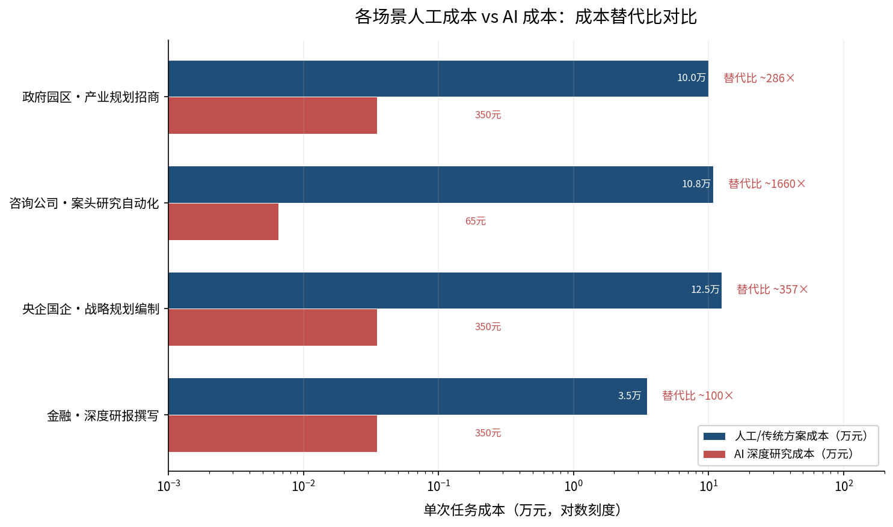

上图以对数刻度对比四个核心场景下人工/传统方案成本与 AI 深度研究成本的差异。咨询公司案头研究自动化场景的成本替代比最高，达约 1660 倍；央企国企战略规划编制约 357 倍；政府园区产业规划招商约 286 倍；金融深度研报撰写约 100 倍。即使替代比最低的金融场景，AI 报告定价（200–500 元/份）也仅为人工研报成本（2–5 万元/份）的 1/100 至 1/25，价格竞争力依然充分。

### 场景到产品形态的映射

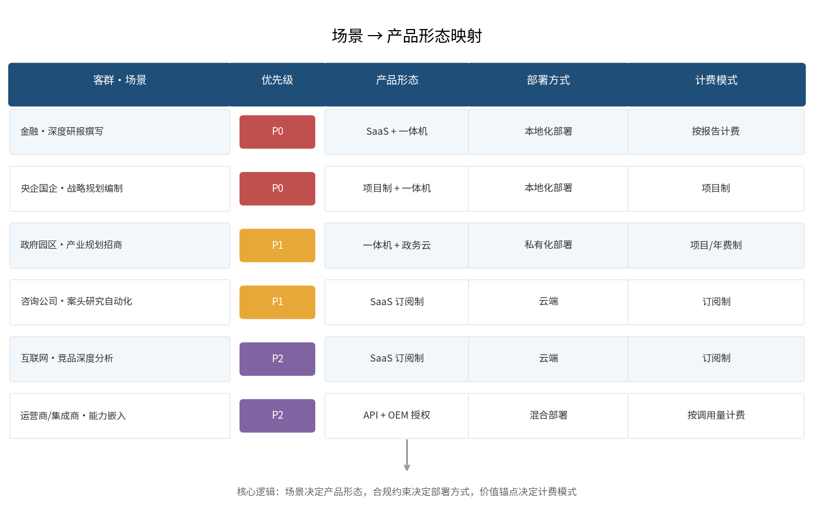

上图展示了六大客群核心场景与产品形态、部署方式、计费模式的一一映射关系。映射遵循三条核心逻辑：**场景决定产品形态**——高合规场景（金融、央国企、政府）对应一体机 + 私有化部署，轻合规场景（咨询、互联网）对应 SaaS/云端；**合规约束决定部署方式**——91% 金融行业要求本地化部署、政务一体机为刚需、央国企信创为硬性要求；**价值锚点决定计费模式**——高客单价、低频场景适合按报告/项目制计费，高频、标准化场景适合订阅制或按调用量计费。

### 从场景到需求映射的关键洞察

综合全章分析，可得出三个关键判断：

**第一，"低频高价值"是深度研究智能体的天然定位。** 单份报告约 2 小时的端到端耗时和 50–80 元的推理成本，决定了产品无法也不应与分钟级、元级成本的通用问答工具竞争。但在人工研报成本 2–5 万元/份、咨询项目案头研究人力成本数千美元/天的场景中，50–80 元的推理成本具备极强的成本替代优势。这一"低频高价值"定位恰恰是竞品——百度千帆 2.5 元/次（分钟级报告）、OpenAI 10–57 元/次（5–30 分钟报告）——无法覆盖的空白地带。

**第二，私有化部署是政企场景的"入场券"而非"加分项"。** 金融 91% 本地化部署、政务一体机刚需、央国企信创/国产化硬性要求——这些合规约束不是产品层面的竞争优势，而是市场准入的必要条件。智谱在私有化部署上的既有积累构成了进入壁垒。

**第三，"报告交付"是天然的计费单元。** IDC 预测 2030 年全球 22.16 亿 AI Agent 作为"新数字劳动力"参与企业运营 [BetterYeah/IDC 数据](https://www.betteryeah.com/blog/enterprise-digital-employee-ai-assistant-intelligent-workflow-solution-guide "企业数字员工AI助手指南，2026年3月")。RaaS 模式中，深度研究场景天然适合 L1/L2 层——"报告交付"是离散、可量化、可验收的结果单元 [FBD Agency](https://fbd.agency/blog/results-as-a-service-raas-one-year-later/ "RaaS: Lessons From 12 Months of Reality, 2026年2月")。这为按报告计费的商业模式提供了坚实的产品逻辑。

# 第4章 竞品格局与差异化壁垒构建

前章从场景与需求角度回答了"解决什么问题"，本章转向竞争视角：在同一批高价值场景中，智谱深度研究智能体面对怎样的竞品格局？客户为何选择智谱而非替代方案？如何从"会写长报告的 ChatGPT"这一认知陷阱中突围，构建可防御的差异化壁垒？

## 4.1 竞品全景：四类替代方案的定位与局限

当前市场上与"深度研究/长报告生成"相关的替代方案可归为四类，各自占据不同能力区间与客群层。下图以"研究深度"与"部署模式"两个关键维度，将七类竞品与替代方案定位于不同象限，直观呈现智谱在"超深度+私有化"象限的独占地位。

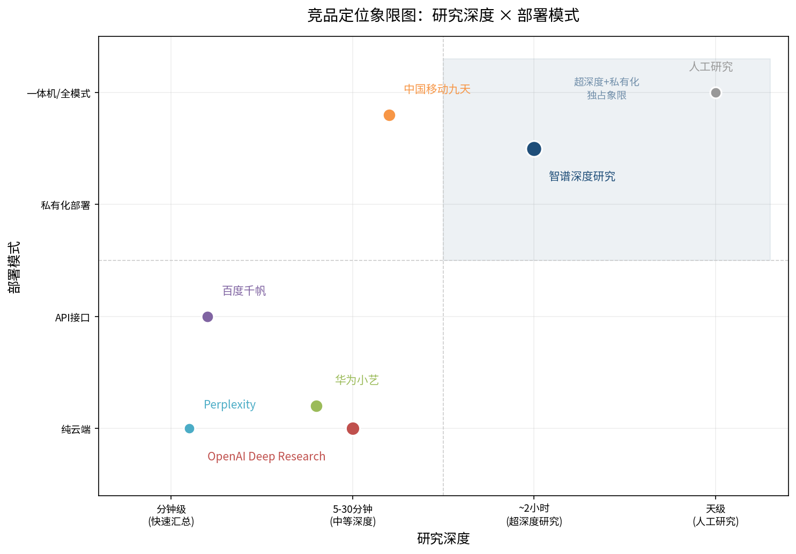

### 4.1.1 国际通用型：OpenAI Deep Research

OpenAI 于 2025 年 2 月推出 Deep Research 功能，定价 Pro 套餐 $200/月（250 次查询）、Plus 套餐 $20/月（25 次查询），单次查询成本换算为人民币约 ¥10.8–57.6/次，单次耗时 5–30 分钟 [OpenAI 官方](https://openai.com/index/introducing-deep-research/ "定价与局限")。在 DRB II 评测中，OpenAI 以总分 45.40 排名第五，其 InfoRecall 维度仅 39.98、Analysis 维度 49.85，显著落后于中国厂商前三名（华为 58.72、南大&阿里 56.31、中国移动 55.39）[DRB II 官网](https://agentresearchlab.com/benchmarks/deepresearch-bench-ii/index.html "DRB II 排行榜")。

在政企场景中，OpenAI 的核心局限尤为突出：不支持私有化部署，数据出境合规问题无法解决；幻觉问题在高准确性要求场景（金融、法律、医疗）中被明确排除适用；中文信息源覆盖不足，无法访问微信公众号、CNKI 等中文"信息孤岛"。上述局限使其在中国 ToB/政企深度研究市场中实质性地退出了竞争。

### 4.1.2 国内 C 端型：华为小艺 DeepResearch

华为小艺在 DRB I 以 57.00 分排名第二（与智谱 57.06 仅差 0.06 分），在 DRB II 以 58.72 分排名第一 [DeepResearch Bench GitHub](https://github.com/Ayanami0730/deep_research_bench "2026年5月7日排行榜") / [DRB II 官网](https://agentresearchlab.com/benchmarks/deepresearch-bench-ii/index.html "DRB II 排行榜")。从技术能力看，华为是智谱在 DRB 评测体系内最接近的竞争者。

然而，华为小艺 DeepResearch 的商业模式是纯 C 端消费级产品，其"高阶功能包"售价 60 元/10 次，折合 ¥6/次 [华为官网](https://consumer.huawei.com/cn/support/content/zh-cn16076171/ "小艺深度研究功能介绍")。关键限制在于：无 ToB 部署方案、无 API 接口、无私有化部署能力，无法进入金融 91% 本地化部署刚需场景和政务/央国企信创环境 [IDC 报告](https://finance.sina.com.cn/stock/hkstock/hkstocknews/2025-06-17/doc-infaktwy2004204.shtml "金融行业GenAI报告")。华为小艺在 ToB 深度研究市场中的角色更接近"技术标杆"而非"商业竞品"——它定义了能力天花板，但不构成渠道冲突。

### 4.1.3 国内 ToB 型：百度千帆深度研究 Agent 与中国移动九天 DeepInsight

百度千帆深度研究 Agent 以 API 形式提供服务，定价 2.5 元/次调用 [百度千帆社区](https://qianfan.cloud.baidu.com/qianfandev/topic/687830 "定价信息")。百度的核心优势在于 25 年搜索积累构建的中文信息源护城河——独家接入微信公众号、百家号等中文"信息孤岛"。然而，¥2.5/次的定价对应的是高频轻量的分钟级报告场景，与智谱 ¥50–80 推理成本、约 2 小时端到端耗时的万字级深度报告定位存在本质差异。两者不在同一价格带，也不在同一能力层：百度千帆解决的是"快速信息汇总"，智谱解决的是"复杂研究交付"。

中国移动九天 DeepInsight 在 DRB II 以 55.39 分排名第三，核心定位为政企业务 [中国移动官网](https://www.10086.cn/aboutus/news/groupnews/index_detail_54689.html "九天DeepInsight成绩")。中国移动已发布九天超融合信创一体机，整合通用算力、智能算力、存储、网络、安全于一体，搭载 139 亿参数语言大模型，可灵活部署于云、边、端，覆盖政务、金融、矿山、水利等行业 [新华网](http://www.news.cn/2024-05/26/c_1212365943.htm "九天超融合信创一体机")。九天 DeepInsight 是智谱在 ToB/政企深度研究市场中**最需正视的竞品**：它具备运营商级私有化部署能力、政务数据安全合规资质、信创适配能力，且背靠中国移动的渠道网络和政企客户关系。

九天 DeepInsight 的潜在局限在于：其模型参数规模（139 亿）远小于智谱 GLM 系列，在复杂推理和长链路分析任务上的深度可能受限；运营商体系内的产品迭代速度和定制灵活性通常低于独立 AI 公司；且中国移动的核心商业模式是算力基础设施与连接服务，深度研究智能体在其产品矩阵中的战略优先级仍待观察。

### 4.1.4 传统替代方案：人工研究、RAG 系统与外部咨询

除 AI 竞品外，真正的"替代方案"还包括三类非 AI 路径：

- **人工研究**：券商研报人力成本 ¥2–5 万/份，定制研报定价 ¥5–100 万/份，人工处理常规研报 3–4 小时、复杂研报 6–8 小时 [同花顺案例](https://field.10jqka.com.cn/20260423/c676214240.shtml "头部券商文档解析案例，2026年4月")；
- **传统 RAG 系统**：DRB 评测量化了 RAG 的结构性瓶颈——LLM with Search 的 RACE 得分仅 35–41 分、有效引用数 4–33 条，而 Deep Research Agent 分别为 47–49 分、31–111 条 [DeepResearch Bench 官网](https://deepresearch-bench.github.io/ "Main Results 表格")。传统 RAG 的五大缺陷（检索片段化、无法跨文档推理、依赖预设索引、缺乏任务规划、缺乏迭代验证）使其无法胜任复杂研究任务；
- **外部咨询**：MBB 中型项目 8 周约 120 万美元，案头研究占项目总工时 30%–50% [Case Interview Hub](https://www.caseinterviewhub.com/post/cost-mckinsey-consulting-project "McKinsey咨询项目实际成本，2026年4月")。

上述三类替代方案定义了智谱深度研究智能体的价值锚点——并非替代人工的全部价值，而是在"案头研究"这一特定环节实现 10–100 倍的成本效率提升。

## 4.2 认知陷阱："会写长报告的 ChatGPT"从何而来

"会写长报告的 ChatGPT"这一认知陷阱是智谱在 ToB 销售中面临的首要障碍。其根源可拆解为四个层面：

下图基于 DRB 评测公开数据，对比智谱、华为与 OpenAI 在 RACE（全面性、洞察力、指令遵循、可读性）与 FACT（引用准确、有效引用数）六个维度上的能力差异结构，并标注 LLM+Search 基线。OpenAI 在"有效引用数"维度与国产模型的断崖式差距，是认知陷阱的核心反证。

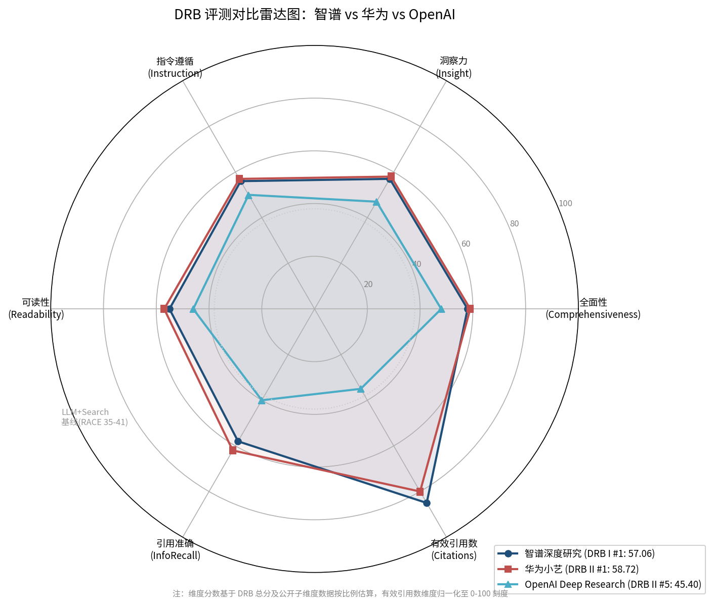

**第一，UI 同构性。** OpenAI 将 Deep Research 嵌入 ChatGPT 对话框，用户交互方式与普通问答完全一致。这种 UI 设计使用户难以感知"多轮自主检索→任务分解→交叉验证→结构化报告"这一 Agent 行为与"单次生成"之间的质变差异 [DeepResearch Bench 官网](https://deepresearch-bench.github.io/ "评测框架详情")。

**第二，能力谱系连续性错觉。** 用户倾向于将 Deep Research 视为 ChatGPT 的"升级版"而非"不同物种"。然而 DRB 数据表明，LLM with Search 的 RACE 得分（35–41 分）与 Deep Research Agent（47–49 分）之间存在约 20%–40% 的绝对差距，有效引用数差异更为悬殊（4–33 vs 31–111）——这不是量变，而是质变 [DeepResearch Bench 官网](https://deepresearch-bench.github.io/ "Main Results 表格")。

**第三，企业采购方知识缺口。** 多数企业 IT 采购决策者对"Agent"与"Chatbot"的技术差异缺乏认知，采购评估仍停留在"模型能力对比"层面，忽略了任务规划、多轮检索、质量可控等 Agent 级能力维度 [LinkedIn](https://www.linkedin.com/posts/arjun-thazhath_most-businesses-are-still-confusing-ai-agents-activity-7450064525212487680-7X52 "企业认知混淆")。

**第四，媒体简化叙事。** 大众媒体将 Deep Research 类产品统一归入"AI 写报告"，抹平了不同产品在深度、准确性、私有化部署等关键维度上的差异，进一步强化了"只是 ChatGPT 升级版"的公众认知。

## 4.3 差异化叙事：从"更强模型"到"不同物种"

破解认知陷阱的关键不在于强调"我的模型更强"，而在于重新定义产品品类——将智谱深度研究智能体从"AI 写作工具"移出，归入"AI 研究交付"品类。

### 4.3.1 重新定义品类：研究交付而非内容生成

品类重新定义的核心论据来自 DRB 评测体系的底层设计。DRB 采用 RACE + FACT 双框架评估，RACE 衡量报告生成质量（全面性、洞察力、指令遵循度、可读性），FACT 衡量信息检索与引用准确性（引用准确率、有效引用数）[DeepResearch Bench 论文](https://arxiv.org/abs/2506.11763 "arXiv:2506.11763, 2025年6月")。这意味着，Deep Research Agent 的核心能力不是"生成文本"，而是"检索→验证→组织→交付"的端到端研究流程。

据此，销售叙事的锚点应设定为：**"智谱深度研究智能体不是一个会写报告的聊天机器人，而是一个能在 2 小时内独立完成一名研究员 2–3 天案头研究工作的 AI 研究员工。"**

这一叙事锚点的量化支撑：
- 单份报告有效引用 31–111 条（vs ChatGPT with Search 的 4–33 条），意味着信息检索的广度和深度存在数量级差异 [DeepResearch Bench 官网](https://deepresearch-bench.github.io/ "Main Results 表格")；
- 端到端耗时约 2 小时（Plan 约 1 小时 + Write 约 1 小时），对应的是万字级深度研究报告场景，而非分钟级信息汇总；
- 真实浏览器交互能力突破模拟浏览局限，可直接访问 CNKI、小红书、微信公众号等需认证平台 [DR Agent 综述](https://www.cnblogs.com/emergence/p/18956327 "博客园")。

### 4.3.2 六大差异化维度

在品类重新定义的基础上，智谱深度研究智能体相对竞品的差异化可归纳为六个维度：

**维度一：端到端闭环能力。** 从任务理解→信息检索→交叉验证→结构化分析→报告生成的全流程自主执行，无需人工干预中间步骤。Rumination 沉思引擎支持递归推理，在信息不足时自主发起二次检索，而非在首次检索结果上强行生成 [DR Agent 综述](https://www.cnblogs.com/emergence/p/18956327 "博客园")。

**维度二：中文信息源深度覆盖。** 独家访问 CNKI、微信公众号、小红书等中文"信息孤岛"，这一能力在百度千帆之外几乎没有竞品可及。对于政务研究、政策分析、国内行业调研等场景，中文信息源的完整度直接决定报告质量。

**维度三：私有化部署能力。** 金融行业 91% 为本地化部署 [IDC 报告](https://finance.sina.com.cn/stock/hkstock/hkstocknews/2025-06-17/doc-infaktwy2004204.shtml "金融行业GenAI报告")，政务场景一体机为刚需 [民生证券](https://pdf.dfcfw.com/pdf/H3_AP202504261662908517_1.pdf "AI+政务研报")——OpenAI 无法满足，华为小艺无 ToB 方案，百度千帆虽有 API 但缺少一体机部署选项。私有化部署是进入金融和政务市场的门票，而智谱已持有该门票。

**维度四：信创/国产化适配。** 央企国企采购对国产化有硬性要求，智谱基于国产算力芯片的适配能力是 OpenAI 完全不具备、中国移动九天具备但在模型深度上可能不足的差异化维度。

**维度五：任务规划与质量可控。** Plan 阶段约 1 小时的任务分解与信息搜集规划，确保最终报告的结构完整性；Write 阶段约 1 小时的递归推理与质量校验，确保分析的深度与一致性。这种"慢工出细活"的架构设计，正是高价值研究场景所需——客户为质量付费，而非为速度付费。

**维度六：超深度万字级定位的空白市场。** 约 2 小时端到端耗时、¥50–80 推理成本对应的是万字级深度研究报告场景，目前市场上无直接竞品占据这一定位。OpenAI 5–30 分钟、Perplexity 2–4 分钟、百度千帆分钟级——所有竞品均处于"快速信息汇总"赛道，智谱是唯一布局"深度研究交付"赛道的产品 [Helicone](https://www.helicone.ai/blog/openai-deep-research "2025年评测")。

## 4.4 壁垒构建方向：从技术优势到商业护城河

技术领先是起点，但技术优势在 AI 领域的衰减速度极快——DRB I 排行榜前五名分差仅 1.02 分（56.04–57.06）即为明证。智谱需将技术领先转化为四类可持续壁垒：

### 4.4.1 数据壁垒：中文信息源与行业知识库

智谱深度研究智能体对 CNKI、微信公众号等认证平台的访问能力，以及 Rumination 沉思引擎的递归检索策略，构成了以数据获取广度为基础的壁垒。随着产品在金融、政务等垂直领域积累行业术语库、报告模板、评审标准等隐性知识，数据壁垒将从"信息源覆盖"升级为"行业认知深度"。

这一壁垒的防御性在于：中文信息孤岛的认证访问机制（如 CNKI 机构账号、微信公众号 API 授权）具有排他性，先发者的渠道积累难以被后来者快速复制。

### 4.4.2 部署壁垒：私有化与信创生态

智谱 2024 年本地化部署收入占总营收 84.5%，毛利率 59.1%–66.0% [36氪/招股书](https://m.36kr.com/p/3628998562776324 "智谱业务结构")——这一业务结构表明，私有化部署不仅是能力，更是已验证的商业模式。在金融和政务市场中，私有化部署 + 信创适配是准入门槛，而非加分项。

大模型一体机市场（50–500 万元/台）的竞争核心不是参数量，而是"开箱即用"的部署体验和"行业场景即插即用"的应用生态 [头豹研究院](https://www.fxbaogao.com/detail/4952520 "大模型一体机行业研究")。智谱需在一体机产品中预置金融投研、政策研究、行业分析等场景模板，将部署壁垒从"能部署"升级为"部署后即产生价值"。

### 4.4.3 流程壁垒：从工具到工作流嵌入

工具可替换，但嵌入工作流的系统难以替换。智谱深度研究智能体的壁垒方向应从"单次报告交付工具"升级为"研究工作流编排平台"——将报告需求管理、多源信息采集、质量审核、版本迭代、知识沉淀等环节串联为端到端工作流。

这一方向的可行性在于：金融和政务场景的研究流程高度标准化（立项→案头研究→内部评审→修订→发布），而当前 AI 产品仅覆盖"案头研究"单一环节。将覆盖范围从单环节扩展至全流程，可大幅提升客户替换成本。

### 4.4.4 生态壁垒：渠道伙伴与行业共创

智谱已与神州数码建立"领航级合作伙伴"关系，与 200+ 企业深度共创，1000+ 大模型规模化应用 [东方财富/雪球](https://guba.eastmoney.com/news,834261,1670121226.html "神州数码领航级合作")。在运营商渠道，智谱与中国移动存在竞合关系——九天 DeepInsight 为竞品，但智谱大模型已接入中国移动算力网络。

生态壁垒的构建逻辑在于：深度研究智能体作为"能力组件"而非"独立产品"嵌入集成商/运营商的行业解决方案中，通过 OEM/白标授权、联合解决方案等模式，使渠道伙伴的交付能力依赖于智谱的技术底座，从而形成"渠道依赖型壁垒"。

## 4.5 竞品对比矩阵

| 维度 | 智谱深度研究 | OpenAI Deep Research | 华为小艺 | 百度千帆 | 中国移动九天 |
|------|-------------|---------------------|---------|---------|------------|
| DRB I 排名 | #1 (57.06) | 未提交 | #2 (57.00) | 未提交 | 未提交 |
| DRB II 排名 | 未提交 | #5 (45.40) | #1 (58.72) | 未提交 | #3 (55.39) |
| 单次成本 | ¥50–80/份 | ¥10.8–57.6/次 | ¥6/次 | ¥2.5/次 | 未公开 |
| 端到端耗时 | ~2小时 | 5–30分钟 | 分钟级 | 分钟级 | 未公开 |
| 私有化部署 | ✅ | ❌ | ❌ | ❌（仅API） | ✅ |
| 信创适配 | ✅ | ❌ | ✅ | 部分 | ✅ |
| 中文信息孤岛 | ✅ | ❌ | ✅ | ✅ | 部分 |
| ToB 销售体系 | ✅ | ❌ | ❌ | ✅ | ✅ |
| 目标客群 | ToB/政企 | C端/国际 | C端 | 开发者/ToB | 政企 |

注：百度千帆标注"❌（仅API）"指其提供 API 服务但不具备一体机私有化部署方案；九天 DeepInsight 部分维度标注"未公开"系因其产品处于持续迭代中，部分参数尚未对外披露。

## 4.6 对"为什么选智谱"的收敛判断

综合竞品格局分析，智谱深度研究智能体的差异化壁垒可收敛为三层递进逻辑：

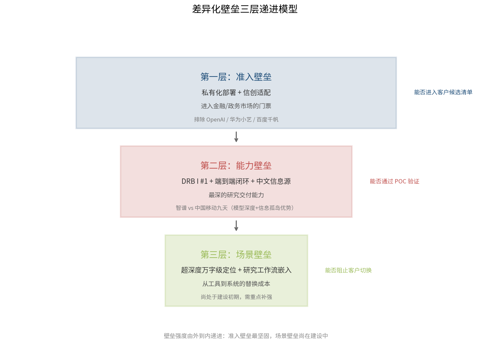

**第一层（准入壁垒）：私有化部署 + 信创适配 = 进入金融和政务市场的门票。** 在这一层，竞品缩减为智谱 vs 中国移动九天。OpenAI 被排除（无法私有化部署），华为小艺被排除（无 ToB 方案），百度千帆被排除（无一体机部署选项）。

**第二层（能力壁垒）：DRB I #1 + 端到端闭环 + 中文信息源深度覆盖 = 最深的研究交付能力。** 在这一层，智谱相对九天 DeepInsight 的优势体现在模型深度（GLM 系列参数规模远大于九天 139 亿参数）和中文信息孤岛访问能力。

**第三层（场景壁垒）：超深度万字级定位 + 研究工作流嵌入 = 从工具到系统的替换成本。** 在这一层，智谱从"能生成报告"升级为"能交付研究"，从"单次调用"升级为"工作流编排"，构建客户替换的系统级阻力。

三层壁垒的递进关系是：准入壁垒决定"能否进入客户候选清单"，能力壁垒决定"能否通过 POC 验证"，场景壁垒决定"能否阻止客户切换"。智谱当前在第一层壁垒最为坚固（主要竞品均被排除），第二层有评测数据支撑但需持续投入维持领先，第三层尚处于建设初期——这正是商业化推进中需要重点补强的方向。

# 第5章 商业模式与定价策略

前章从竞品比较维度回答了"为什么选智谱"，本章转向商业化核心命题：智谱深度研究智能体如何将技术能力转化为可收费的产品与服务？定价如何兼顾毛利空间与客户付费意愿？不同客群如何匹配差异化的商业模式？本章以单份报告推理成本 ¥50–80 为锚点，推导定价区间与毛利结构，并为金融、央国企、运营商/集成商等优先客群设计差异化商业方案。

## 5.1 商业模式底层逻辑：从"工具"到"结果"的价值跃迁

### 5.1.1 为何不能走传统 SaaS 订阅路线

传统 SaaS 按人头/按席订阅的逻辑建立在两个前提上：边际交付成本趋近于零，以及用户使用频率可预测。智谱深度研究智能体的成本结构与此截然不同——单份报告推理成本 ¥50–80，Plan 阶段约 1 小时、Write 阶段约 1 小时，端到端耗时约 2 小时。这意味着每次调用都产生实质性推理成本，且单次交付耗时远超交互式问答。若按 ¥200/月/人的订阅制收费，月产 5 份报告即产生 ¥250–400 推理成本，订阅费无法覆盖可变成本。

更深层的逻辑在于：智谱深度研究智能体交付的不是"使用权限"，而是"研究结果"。客户购买的是一份万字级深度报告——一个离散的、可量化的、具有明确业务价值的输出物。这与 RaaS（Results-as-a-Service）模式天然契合 [FBD Agency](https://fbd.agency/blog/results-as-a-service-raas-one-year-later/ "RaaS: Lessons From 12 Months of Reality, 2026年2月")。以 Sierra AI 为参照，其按客服工单 $0.99/个计费，对标人工 $10–20/次，70% 请求由 AI 独立解决 [Forbes](https://www.forbes.com/councils/forbestechcouncil/2025/04/23/from-saas-to-raas-how-ai-agents-are-redefining-software/ "From SaaS To RaaS, 2025年4月")。类比而言，智谱深度研究智能体的计费单元应当是"报告"而非"账号"。

### 5.1.2 RaaS 混合定价框架

RaaS 在实际落地中表现为混合定价结构：基础费用占 30–50%（覆盖平台与模型成本）、结果组件占 50–70%（按交付物计费）、上下限保护机制（避免成本失控或收入归零）[FBD Agency](https://fbd.agency/blog/results-as-a-service-raas-one-year-later/ "RaaS: Lessons From 12 Months of Reality, 2026年2月")。深度研究场景天然适配这一框架——"报告交付"是离散可量化的结果单元，客户可直观评估每份报告的价值。

将混合定价框架映射到智谱深度研究智能体的产品形态，形成四种核心商业模式：

| 模式 | 计费方式 | 目标客群 | 毛利率区间 |
|------|----------|----------|------------|
| SaaS 按报告计费 | ¥200–500/份 + 用量阶梯 | 金融/互联网 | 60–70% |
| 私有化部署 | 硬件 + 软件授权年费 + 实施运维 | 央国企/政务 | 纯软件 70–80% |
| API 服务 | 单次调用 ≥ ¥100–150 | 开发者/集成商 | 50%+ |
| 解决方案包 | 项目制 ¥50–2000万 | 运营商/集成商 | 30–50%（含实施）|

## 5.2 成本结构与定价推导

### 5.2.1 单份报告成本拆解

智谱深度研究智能体单份报告推理成本约 ¥50–80。横向对比竞品单次查询成本——OpenAI o3 约 ¥10.8–57.6/次、o4-mini 约 ¥2.9–18/次、Perplexity API 约 ¥3–10/次、华为小艺 ¥6/次、百度千帆 ¥2.5/次——智谱的单次推理成本显著偏高 [OpenAI](https://openai.com/api/pricing/ "API定价页") / [华为官网](https://consumer.huawei.com/cn/support/content/zh-cn16076171/ "小艺定价") / [百度千帆](https://qianfan.cloud.baidu.com/qianfandev/topic/687830 "千帆定价")。但这一对比具有误导性：竞品的"单次查询"产出的是分钟级短报告，而智谱的"单份报告"产出的是约 2 小时端到端的万字级深度研究报告。两者不在同一交付层级，成本差异反映的是产品定位差异而非效率劣势。

AI-First SaaS 的行业毛利率基准为 50–65%，低于传统 SaaS 的 80–90% [Monetizely/Bessemer](https://www.getmonetizely.com/blogs/the-economics-of-ai-first-b2b-saas-in-2026 "AI-First B2B SaaS Economics, 2025")。作为参照，OpenAI 运营毛利率约 50%，Anthropic 约 60% [Monetizely/Bessemer](https://www.getmonetizely.com/blogs/the-economics-of-ai-first-b2b-saas-in-2026 "AI-First B2B SaaS Economics, 2025")。以 ¥50–80/份推理成本为基数，智谱深度研究智能体若要维持行业可比的毛利率水平：

- **毛利率 60%**：定价 ≥ ¥125–200/份（即推理成本的 2.5 倍）
- **毛利率 70%**：定价 ≥ ¥167–267/份（即推理成本的 3.3 倍）
- **毛利率 80%**：定价 ≥ ¥250–400/份（即推理成本的 5 倍）

下表汇总了不同商业模式在 ¥50–80/份推理成本基准下的定价区间与对应毛利率：

| 商业模式 | 定价区间 | 推理成本覆盖 | 毛利率区间 |
|----------|----------|-------------|------------|
| SaaS 按报告计费 | ¥200–500/份 | 智谱承担 | 60–70% |
| 私有化部署（纯软件授权） | 年费为硬件 20–30% | 客户自供算力 | 70–80% |
| API 服务 | ≥ ¥100–150/次 | 智谱承担 | 50%+ |
| 解决方案包（项目制） | ¥50–2000 万/项目 | 视部署方式而定 | 30–50%（含实施）|

考虑到私有化部署场景中客户自供算力可显著降低推理成本（客户承担硬件折旧与电力成本），纯软件授权的毛利率可提升至 70–80% 区间。

### 5.2.2 价值锚定：从人工成本推算支付意愿

定价不能仅从成本加成推导，更应从客户侧价值锚定。在目标客群中，人工生产同等深度研究报告的成本为：

- **券商研报**：人力成本约 ¥2–5 万/份，定制研报定价 ¥5–100 万/份 [同花顺案例](https://field.10jqka.com.cn/20260423/c676214240.shtml "头部券商文档解析私有化部署案例，2026年4月")
- **咨询公司案头研究**：Associate 日费 ¥4.2 万、Partner 超 ¥7 万，MBB 中型项目 8 周约 ¥840 万 [Case Interview Hub](https://www.caseinterviewhub.com/post/cost-mckinsey-consulting-project "McKinsey咨询项目实际成本，2026年4月")
- **国企"十五五"规划外部咨询**：国际顶级 ¥500–2000 万，国内一线 ¥200–800 万，第三方行业报告 ¥5–20 万/份 [知乎/行业分析](https://zhuanlan.zhihu.com/p/27508266656 "国企编制十五五规划费用分析，2026年")

若以人工成本的 1/10–1/50 作为 AI 报告定价区间，则金融场景的支付意愿区间为 ¥200–2000/份，央国企战略研究场景为 ¥1000–5000/份，咨询案头研究场景为 ¥500–2000/份。这些价值锚点远高于 ¥125–400 的成本加成定价区间，表明定价空间充裕，关键在于如何让客户感知到与人工交付物的可比价值。

### 5.2.3 避免价格战：与百度千帆的差异化定价逻辑

百度千帆深度研究 Agent 定价 ¥2.5/次调用 [百度千帆社区](https://qianfan.cloud.baidu.com/qianfandev/topic/687830 "定价信息")，表面上看与智谱的 ¥200+/份形成巨大价差。但需厘清三点：其一，¥2.5/次是 API 层模型调用计费，仅覆盖推理的极小部分，无法覆盖 ¥50–80/份的完整推理成本，商业可持续性存疑；其二，百度千帆产出的是分钟级短报告，智谱产出的是约 2 小时万字级深度报告，两者不在同一交付层级；其三，千帆不提供私有化部署与信创适配，无法进入金融 91% 本地化部署和央国企信创刚需场景 [IDC 报告](https://finance.sina.com.cn/stock/hkstock/hkstocknews/2025-06-17/doc-infaktwy2004204.shtml "金融行业GenAI报告")。

价格战的本质是同质化竞争。智谱的"低频高价值"定位与千帆的"高频低成本"定位分属不同市场——正如顶级咨询公司不会与信息检索工具打价格战，万字级深度研究报告也不应与分钟级信息汇总比拼单价。

## 5.3 差异化定价方案设计

### 5.3.1 金融行业：按报告计费 + 私有化部署一体机双轨定价

金融行业是付费意愿最强、定价锚定最高的客群。2024 年中国金融行业生成式 AI 市场规模约 9.14 亿元，IDC 预测 2027 年将升至 35.09 亿元，其中 91% 为本地化部署 [IDC 报告](https://finance.sina.com.cn/stock/hkstock/hkstocknews/2025-06-17/doc-infaktwy2004204.shtml "金融行业GenAI市场份额，2024")。2025 年金融大模型中标项目金额同比增长 527%，智能体应用类项目金额集中在 ¥30–150 万 [艾瑞咨询](https://news.qq.com/rain/a/20260209A03D5G00 "金融大模型招投标分析，2026年2月")。金融场景的双轨定价设计需同时覆盖 SaaS 云端客户与本地化部署客户。

**SaaS 按报告计费方案：**

| 报告类型 | 定价 | 交付物 | 对标人工成本 |
|----------|------|--------|-------------|
| 行业速览报告 | ¥200/份 | 3000–5000 字行业概览 | ¥5000–10000 |
| 深度研报 | ¥500/份 | 万字级深度分析 + 多源引用 | ¥2–5 万 |
| 定制课题报告 | ¥1500–2000/份 | 按需求定制的专题研究 | ¥5–20 万 |

用量阶梯设计：月产 1–10 份按标准价，11–30 份 9 折，31–50 份 8 折，50 份以上 7 折。阶梯折扣的经济学逻辑在于：客户使用量增大后，其内部流程与知识库适配度提升，单份报告的边际支持成本下降。

**私有化部署一体机方案：**

大模型一体机市场价位 50–500 万元/台：高端 150–500 万（671B 参数训推一体），中端 50–150 万（100–300 亿参数）[头豹研究院](https://www.fxbaogao.com/detail/4952520 "大模型一体机行业研究")。中国电信一体机平均单项目 ¥120 万 [电子工程专辑](https://www.eet-china.com/mp/a394096.html "一体机盈利模式分析")。

金融场景推荐中高端一体机方案，定价 ¥150–500 万/台，包含：

- 硬件（GPU 服务器 + 存储 + 网络）
- 深度研究智能体软件授权（年费另计，约硬件的 20–30%/年）
- 实施部署与知识库对接（一次性费用 ¥30–80 万）
- 年度运维与模型更新（¥20–50 万/年）

纯软件授权毛利率可达 70–80%，硬件+软件综合毛利率 30–50%。一体机模式的核心价值不在硬件利润，而在于锁定客户年费收入与构建迁移壁垒——客户部署一体机后，切换供应商的成本极高。

### 5.3.2 央国企/政务：项目制 + 信创一体机 + 年度服务费

央国企数智化市场 2024 年达 3670 亿元，AI 应用市场 2025 年预计 440 亿元（+40%）[央国企 AI 数智化转型白皮书](https://www.ageclub.net/article-detail/7823 "央企数智化转型市场规模，2025")。央企考核机制已将数字化转型纳入 KPI，"数据资产增值率"权重占比达 15%，部分能源集团按营收 3% 计提数字化转型专项资金 [科学网](https://wap.sciencenet.cn/blog-3525898-1490721.html?mobile=1 "十五五央企数字化转型战略规划研究")。

央国企采购呈现四个典型特征：决策链路长、预算确定性高、信创/国产化要求硬性、偏好项目制而非按量计费。定价方案应适配这一采购习惯：

**信创一体机方案**：¥200–500 万/台，适配国产芯片（鲲鹏/昇腾/海光等），预装深度研究智能体软件。价格高于通用一体机，溢价来自信创适配投入。

**项目制解决方案包**：¥50–2000 万/项目，覆盖"十五五"规划研究、行业对标分析、政策研究等场景。项目制定价依据：国际顶级咨询 ¥500–2000 万，国内一线 ¥200–800 万 [知乎/行业分析](https://zhuanlan.zhihu.com/p/27508266656 "国企编制十五五规划费用分析，2026年")。智谱定价为同级别人工咨询的 1/5–1/10，兼顾客户价值感知与自身毛利空间。

**年度服务费**：¥30–80 万/年，包含固定额度的报告产出（如月产 10 份深度报告）、知识库更新与模型迭代。年度服务费将项目制的一次性收入转化为经常性收入，提升客户生命周期价值。

### 5.3.3 运营商/集成商：OEM 授权 + 联合解决方案分成

运营商与集成商并非终端客户，而是渠道合作伙伴。其核心诉求是将 AI 深度研究能力包装进自有解决方案，向政企客户销售。智谱的定价逻辑需平衡渠道利润空间与自身收益。

**OEM/白标授权**：按调用次数计费，¥100–150/次（API 内部结算价），保证智谱 50%+ 毛利率；集成商对外报价 ¥200–500/次，毛利率 50–75%。中国移动灵犀智能体用户突破 2 亿 [中国移动官网](https://www.10086.cn/aboutus/news/groupnews/index_detail_53561.html "中国移动AI+战略，2025年")，具备庞大的政企客户触达网络，OEM 模式可快速扩展覆盖面。

**联合解决方案**：项目制 ¥100–500 万，智谱提供技术组件（模型 + 智能体框架），集成商负责行业适配与交付。利润分成比例建议 4:6 或 3:7（智谱 : 集成商），因集成商承担客户关系、项目交付和回款风险，应获得更大比例。

**生态合作伙伴模式**：参照智谱与神州数码"领航级合作伙伴"关系 [东方财富/雪球](https://guba.eastmoney.com/news,834261,1670121226.html "神州数码领航级合作")，以年度框架协议锁定最低采购量（如年采购 5000 份报告额度），享受阶梯折扣。框架协议的核心价值在于为智谱提供收入可预测性，同时为合作伙伴提供价格确定性。

### 5.3.4 咨询公司/研究机构：按报告计费 + 增值分析模块

咨询公司是特殊客群——既是潜在客户（用 AI 替代案头研究），也是潜在竞争威胁（AI 可能替代部分初级顾问工作）。定价策略需平衡两个方向：降低其案头研究成本，同时不使其认为 AI 完全可替代人力。

**按报告计费**：¥300–500/份，产出案头研究底稿，由人类顾问二次加工和增值。定价逻辑：案头研究占项目总工时 30–50% [Case Interview Hub](https://www.caseinterviewhub.com/post/cost-mckinsey-consulting-project "McKinsey咨询项目实际成本，2026年4月")，AI 替代该环节可节约 ¥10–30 万/项目的初级人力成本，而 ¥300–500/份的报告费用仅为节约成本的 1–3%。

**增值分析模块**：如行业数据可视化（+¥200/份）、竞争格局矩阵（+¥150/份）、财务模型辅助（+¥300/份）。增值模块将单份报告客单价从 ¥300–500 提升至 ¥650–1250，同时强化"AI 辅助而非 AI 替代"的产品定位，降低咨询公司的抵触心理。

综合上述四个客群的定价方案，下表汇总差异化定价逻辑：

| 客群 | 定价模式 | 客单价区间 | 毛利率区间 | 对标人工成本 |
|------|----------|-----------|------------|-------------|
| 金融行业 | 按报告计费 + 私有化部署一体机 | ¥200–2000/份 或 ¥150–500 万/台 | SaaS 60–70% / 纯软件 70–80% | ¥2–5 万/份 |
| 央国企/政务 | 项目制 + 信创一体机 + 年度服务费 | ¥50–2000 万/项目 或 ¥200–500 万/台 | 30–50%（含实施） | ¥200–2000 万/项目 |
| 运营商/集成商 | OEM 授权 + 联合方案分成 | ¥100–500 万/项目 | API 50%+ / 分成 40–50% | — |
| 咨询公司/研究机构 | 按报告计费 + 增值模块 | ¥300–1250/份 | 60–70% | ¥10–30 万/项目（案头部分） |

## 5.4 定价策略的关键约束与风险对冲

### 5.4.1 成本波动风险

推理成本 ¥50–80/份受 GPU 算力价格波动影响。若算力成本上升 30%，¥125/份的最低毛利率定价将跌破 50% 毛利率线。对冲方式有二：在私有化部署合同中明确"客户自供算力"条款，将推理成本转移给客户；在 SaaS 合同中设置年度价格调整机制，允许根据算力成本变动 ±15% 调价。

### 5.4.2 竞品低价冲击风险

百度千帆 ¥2.5/次、华为小艺 ¥6/次的定价可能被客户用作压价参照。应对策略：在销售沟通中明确区分"信息检索"与"深度研究"的交付差异——前者产出分钟级摘要，后者产出万字级研究报告；在报价单中附上 DRB 评测数据，量化能力差距（LLM with Search 有效引用 4–33 vs Deep Research Agent 有效引用 31–111）[DeepResearch Bench 官网](https://deepresearch-bench.github.io/ "Main Results 表格")。

### 5.4.3 客户预期管理风险

客户可能将 ¥200–500/份的 AI 报告与人工 ¥2–5 万/份的研报直接对比质量，期望 AI 报告达到人类研究员水平。需在交付标准中明确：AI 报告定位为"高质量研究底稿"，需经人类专家审核与增值后方可作为正式成果。这一预期管理既保护客户满意度，也为"AI + 人类"的混合交付模式留出空间。

## 5.5 商业模式演进路径

从商业化启动到规模化，建议分三阶段演进商业模式重心：

**第一阶段（0–6 个月）：按报告计费为主，验证付费意愿**

以 SaaS 按报告计费为切入点，快速验证客户付费意愿与产品价值匹配度。初期以 ¥200–500/份的标准价测试金融行业，收集使用数据与客户反馈。此阶段的核心指标是客户留存率与报告复购率，而非毛利率。

**第二阶段（6–18 个月）：私有化部署一体机放量，提升客单价与毛利率**

验证付费意愿后，启动金融和央国企的私有化部署一体机销售。一体机方案将单客户年度收入从 SaaS 模式的 ¥5–20 万提升至 ¥50–500 万，且纯软件授权毛利率可达 70–80%。此阶段的核心指标是一体机部署数量与年度服务费续约率。

**第三阶段（18 个月以上）：渠道合作 + 生态扩展，规模化复制**

通过运营商/集成商渠道合作实现规模化复制，以 OEM 授权和联合解决方案模式扩展覆盖面。此阶段的核心指标是渠道合作伙伴数量与渠道贡献收入占比，目标为渠道收入占总收入 30%+。

下表展示三阶段收入结构的变化趋势：

| 阶段 | 时间范围 | 主要收入来源 | 收入结构占比 | 核心指标 |
|------|----------|-------------|-------------|----------|
| 第一阶段 | 0–6 个月 | SaaS 按报告计费 | SaaS ~70% | 客户留存率、报告复购率 |
| 第二阶段 | 6–18 个月 | 私有化部署 + 年度服务费 | 私有化部署 ~50% | 一体机部署数、服务费续约率 |
| 第三阶段 | 18 个月以上 | 渠道合作 + 生态扩展 | 渠道合作 ~40% | 合作伙伴数、渠道收入占比 |

# 第6章 销售策略、试点方案与切入路径

前章完成了商业模式与定价策略设计——按报告计费为核心，私有化一体机为利润引擎，渠道合作为规模杠杆。本章聚焦最终落地问题：智谱深度研究智能体如何从技术成果转化为智谱北方交付中心可销售的政企解决方案；销售话术如何穿透"会写长报告的 ChatGPT"认知陷阱；试点如何设计以规避 95% 生成式 AI 项目无法产生可衡量商业价值的陷阱；以及从试点到规模化复制的路径如何规划。

## 6.1 Go-to-Market 总体框架：双轨并行、时序侧重

### 6.1.1 从交付中心能力基础出发

智谱 2025 年上半年服务机构客户超 1.2 万名，2024 年本地化部署收入占总营收 84.5%，毛利率 59.1%–66.0%；企业级智能体收入 1.66 亿元，同比增幅 248.8% [36氪/招股书](https://m.36kr.com/p/3628998562776324 "智谱业务结构") / [新浪财经](https://finance.sina.com.cn/wm/2026-04-10/doc-inhtzxru4826823.shtml "智谱2025年财报分析")。上述数据表明，智谱在 ToB/政企市场已具备可观的客户基数与收入规模，且本地化部署为绝对主力——这与深度研究智能体"91% 金融客户要求本地化部署"的需求高度契合 [IDC 报告](https://finance.sina.com.cn/stock/hkstock/hkstocknews/2025-06-17/doc-infaktwy2004204.shtml "金融行业GenAI报告")。

然而，智谱本地化部署营业成本中人工成本占 54.4% [虎嗅](https://www.huxiu.com/article/4820128.html "智谱AI成本结构拆解")，意味着当前交付模式仍以项目定制化为主，规模化复制的瓶颈不在技术而在交付效率。智谱北方交付中心的核心使命，在于推动从"按项目定制交付"（高毛利但不可扩展）向"标准化产品 + 可配置交付"（可扩展且毛利可控）转型，将交付周期从数月压缩至数周 [36氪](https://m.36kr.com/p/3628998562776324 "智谱从定制化向标准化转型")。深度研究智能体恰好是这一转型的抓手产品——其交付物标准化程度高（研究报告），客户需求共性大（投研/政策/战略分析），天然适配"产品化交付"路径。

### 6.1.2 双轨并行策略：直销验证 + 渠道扩展

Go-to-Market 策略采用双轨并行但时序侧重的方式：

**第一轨（月 1–3）：金融直销 MVP 验证。** 金融行业是付费意愿最强、决策链路中等、产品标准化程度最高的客群。银行保险业 AI Agent 生产率最高（47%）、试点转化率最高（58%）[Digital Applied/Forrester](https://www.digitalapplied.com/blog/ai-agent-adoption-2026-enterprise-data-points "AI Agent采用率数据")。以直销模式切入金融投研场景，可快速验证产品价值假设与付费意愿假设。此阶段目标是完成 3–5 家金融机构的 MVP 试点，积累案例与量化 ROI 数据。

**第二轨（月 4–6）：运营商/集成商渠道合作启动。** 渠道激活率 ≥ 40% 的前提是产品先通过市场验证 [Scalarly](https://scalarly.com/blog/channel-strategy-direct-sales-vs-partner-channels/ "Channel Strategy, 2026年1月")。在直销验证成功后，启动与神州数码（"领航级合作伙伴"，与 200+ 企业深度共创 [东方财富/雪球](https://guba.eastmoney.com/news,834261,1670121226.html "神州数码领航级合作")）、运营商等渠道的合作，将深度研究智能体嵌入其政企解决方案。

双轨并行的经济学逻辑源于 B2B 销售周期的分层特征：ACV < ¥10 万的交易型客户约 25–40 天完成采购；¥10–50 万中型客户约 75 天；¥100–250 万企业精简版约 170 天；> ¥250 万战略企业级 220–270+ 天 [HumanR.ai](https://www.humanr.ai/intelligence/b2b-tech-sales-cycle-benchmarks-by-deal-size "B2B销售周期基准")。映射到智谱的产品形态：SaaS 年费 ¥5–20 万对应 75–120 天销售周期，一体机 150–500 万对应 170–270 天，解决方案包 50–2000 万对应 270+ 天。月 1–3 的直销 MVP 需选择销售周期 ≤ 120 天的产品形态（SaaS 按报告计费），月 4–6 启动的渠道合作则瞄准更长的销售周期和更大的客单价。

## 6.2 MVP 试点方案：90 天框架与关键 KPI

### 6.2.1 为什么需要严格的试点框架

MIT 2025 年报告显示 95% 的生成式 AI 试点无法产生可衡量的商业价值；42% 企业在 2025 年废弃了大部分 AI 项目，该比例从 2024 年的 17% 急剧攀升 [IBM Think](https://www.ibm.com/think/insights/ai-roi "AI ROI, IBM") / [Beam AI](https://beam.ai/agentic-insights/why-42-percent-of-ai-projects-show-zero-roi-and-how-to-be-in-the-58-percent "AI项目ROI分析")。AI 试点的核心失败模式可归纳为四类：以技术能力而非业务痛点为起点、未在开发前设定量化 KPI、预算分配失当（算法占比过高而人员流程投入不足）、选择内部自建而非采购外部专业工具（采购外部工具成功率 67% vs 内部自建 33%）[Fracto](https://www.fracto.ie/blog-posts/ai-pilot-to-production-90-day-enterprise-framework "90-Day AI Pilot Framework")。

智谱深度研究智能体的试点方案必须规避上述失败模式。以下采用行业标准 90 天试点框架 [Fracto](https://www.fracto.ie/blog-posts/ai-pilot-to-production-90-day-enterprise-framework "90-Day Framework")，并针对深度研究场景进行定制化调整。

### 6.2.2 90 天试点框架设计

**Phase 0：用例选择与客户筛选（Week 0，启动前 1 周）**

核心原则：以可量化业务痛点为起点，而非以技术能力展示为起点。试点客户筛选标准：

- 客户已有明确的"研究产出"业务流程（如投研报告、政策研究、战略分析），而非"探索 AI 能做什么"
- 客户愿意提供 3–5 个历史研究课题作为测试基准，可对比 AI 报告与人工报告的质量与效率
- 客户决策链路 ≤ 3 层（业务部门负责人 → IT 部门 → 分管领导），避免央国企式的多级审批链路
- 客户愿意指定 1 名内部"试点负责人"（Named Agent Owner），赋予预算权限——数据显示 94% 成功的 AI Agent 试点都有命名负责人且有预算权限 [Digital Applied](https://www.digitalapplied.com/blog/ai-agent-adoption-2026-enterprise-data-points "AI Agent采用率数据")

首期试点建议选择 3–5 家金融机构（券商/基金为主），原因如下：金融 Agent 试点转化率 58%（各行业最高）[Digital Applied](https://www.digitalapplied.com/blog/ai-agent-adoption-2026-enterprise-data-points "AI Agent采用率数据")；券商研报人力成本 ¥2–5 万/份，AI 替代价值最直观；金融 91% 本地化部署需求与一体机产品形态高度匹配。

**Phase 1：发现与需求定义（Weeks 1–3）**

活动清单：

- 与客户投研团队深度访谈，梳理现有报告生产流程（立项 → 数据采集 → 分析 → 撰写 → 审核 → 发布）
- 确定试点聚焦的 2–3 个报告类型（如行业深度研报、公司覆盖报告、宏观月报），避免"什么都能做"的模糊定位
- 共同定义 AI 报告的质量评估标准：全面性（信息覆盖度）、准确性（引用可验证率）、洞察深度（超越信息汇总的分析判断）、可读性（结构与表达）
- 设定量化 KPI：如"单份报告生产周期从 3–5 个工作日缩短至 1 个工作日""案头研究阶段人力投入减少 60%""报告引用有效率 ≥ 80%"

预算分配遵循 10/20/70 法则 [Fracto](https://www.fracto.ie/blog-posts/ai-pilot-to-production-90-day-enterprise-framework "90-Day Framework")：10% 投入模型调优与提示工程，20% 投入数据对接与知识库构建，70% 投入人员培训与流程重塑。深度研究智能体的特殊性在于，70% 的人员流程投入中，相当部分应分配给"人机协作流程设计"——即 AI 产出的研究底稿如何与人类研究员的审核、增值、签发流程衔接。

**Phase 2：生产架构与私有化部署（Weeks 4–6）**

活动清单：

- 完成私有化部署环境搭建（金融客户硬性要求）
- 对接客户内部知识库与数据源（Wind/Bloomberg 接口、内部研报数据库、行业数据库等）
- 配置智能体参数：报告模板、引用规范、输出格式、质量门控规则
- 建立 A/B 对比机制：同一课题，AI 报告 vs 人工报告，双盲评审

此阶段的关键风险是部署环境与数据对接的复杂度超出预期。对冲方式：在合同中明确"客户需在 Week 2 前提供数据源接口文档和测试账号"，避免因客户侧准备不足延误项目。

**Phase 3：构建、集成与测试（Weeks 7–10）**

活动清单：

- 执行 3–5 个试点课题的 AI 报告生产
- 每份报告完成后与客户研究员进行质量评审会
- 收集量化数据：生产耗时、引用数量与有效率、研究员修改幅度、研究员满意度评分
- 迭代优化：根据评审反馈调整智能体参数

**Phase 4：受控生产推广（Weeks 11–13）**

活动清单：

- 将 AI 报告生产从"试点"扩展到"受控生产"——在限定范围内（如固定 2–3 个行业组）正式使用
- 交付试点总结报告：量化 ROI、质量对比、流程优化建议
- 商务转化：从试点协议转为正式采购合同（SaaS 年费或一体机方案）

### 6.2.3 试点 KPI 体系

| KPI 类别 | 具体指标 | 目标值 | 依据 |
|----------|----------|--------|------|
| 效率 | 单份报告生产周期 | 从 3–5 天缩短至 ≤1 天 | 中信证券"超级研究员"可在几分钟内完成八九万字趋势报告 [财联社](https://www.cls.cn/detail/2198606 "中信证券AI数字员工团队，2025年11月") |
| 效率 | 案头研究人力投入 | 减少 ≥50% | 咨询行业案头研究占项目总工时 30–50%，为 AI 替代价值最高环节 [Case Interview Hub](https://www.caseinterviewhub.com/post/cost-mckinsey-consulting-project "McKinsey咨询项目实际成本，2026年4月") |
| 质量 | 引用有效率 | ≥80% | DRB 评测中智谱有效引用 31–111，显著优于 LLM with Search 的 4–33 [DeepResearch Bench](https://deepresearch-bench.github.io/ "Main Results 表格") |
| 质量 | 研究员修改幅度 | ≤30%（结构级修改） | 参照中信证券标准：AI 产出"媲美 3 年以上工龄研究员" [财联社](https://www.cls.cn/detail/2198606 "中信证券AI数字员工团队，2025年11月") |
| 满意度 | 研究员 NPS | ≥30 | Beam AI 企业客户 NPS 提升 18 分 [Beam AI](https://beam.ai/agentic-insights/why-42-percent-of-ai-projects-show-zero-roi-and-how-to-be-in-the-58-percent "Beam AI成功案例") |
| 商业 | 试点转正式采购率 | ≥50% | 金融 Agent 试点转化率 58% [Digital Applied](https://www.digitalapplied.com/blog/ai-agent-adoption-2026-enterprise-data-points "AI Agent采用率数据") |

## 6.3 销售话术框架：穿透认知陷阱的价值叙事

### 6.3.1 核心认知陷阱与破除策略

"会写长报告的 ChatGPT"是销售过程中最常见也最致命的认知陷阱。其四大根源已在前章识别：UI 同构性（Deep Research 嵌入对话框）、能力谱系连续性错觉（用户认为只是问答升级版）、企业采购方知识缺口、媒体简化叙事 [LinkedIn](https://www.linkedin.com/posts/arjun-thazhath_most-businesses-are-still-confusing-ai-agents-activity-7450064525212487680-7X52 "企业认知混淆")。

销售话术需从三个维度破除这一陷阱：

**维度一：交付物不同。** ChatGPT 产出的是对话式回答（千字级、无结构化引用、无任务规划）；智谱深度研究智能体产出的是研究级报告（万字级、31–111 条有效引用、多轮检索 + 递归推理 + 结构化整合）。DRB 评测已量化这一差距：LLM with Search 的 RACE 得分 35–41 分，Deep Research Agent 的 RACE 得分 47–49 分——这不是量的差异，而是质的跃迁 [DeepResearch Bench](https://deepresearch-bench.github.io/ "Main Results 表格")。

**维度二：过程不同。** ChatGPT 是单轮检索 + 生成；智谱深度研究智能体是 Plan（约 1 小时任务规划与多源检索）+ Write（约 1 小时结构化整合与报告生成）的两阶段闭环。端到端约 2 小时的耗时不是效率劣势，而是深度保证——正如一流咨询公司不会在 15 分钟内交付项目成果。

**维度三：部署不同。** ChatGPT 无法私有化部署，不满足金融 91% 本地化部署要求和央国企信创刚需；智谱深度研究智能体支持一体机私有化部署，适配国产芯片，可对接客户内部知识库与数据源。

### 6.3.2 话术框架：从痛点到方案的四步递进

**第一步：锚定痛点（10 秒）**

> "贵司研究团队每月产出多少份深度报告？每份报告从立项到发布平均多少天？案头研究环节占多少人力投入？"

目的：让客户意识到"研究报告生产"是一个可量化的、成本高昂的业务流程，而非模糊的"AI 应用场景"。

**第二步：抛出量化差距（30 秒）**

> "当前人工生产一份深度研报的人力成本约 2–5 万元，生产周期 3–5 个工作日，案头研究占 60% 以上工时。我们的深度研究智能体可在约 2 小时内产出万字级研究底稿，引用有效率超 80%，单份报告成本仅人工的 1/100。"

数据支撑：券商研报人力成本 [同花顺案例](https://field.10jqka.com.cn/20260423/c676214240.shtml "头部券商文档解析私有化部署案例，2026年4月")；中信证券"超级研究员"案例 [财联社](https://www.cls.cn/detail/2198606 "中信证券AI数字员工团队，2025年11月")。

**第三步：差异化论证（60 秒）**

> "这不是'会写长报告的 ChatGPT'。三个核心差异：第一，ChatGPT 类工具产出的是对话式回答，我们产出的是带 31–111 条有效引用的研究级报告，DRB 评测排名全球第一；第二，我们的 Plan-Write 两阶段架构确保每份报告经过完整任务规划、多轮检索、递归推理，而非单轮检索拼凑；第三，我们支持一体机私有化部署，满足金融行业本地化部署和信创要求。"

数据支撑：DRB I 排名 [DeepResearch Bench GitHub](https://github.com/Ayanami0730/deep_research_bench "2026年5月7日排行榜")；金融 91% 本地化部署 [IDC 报告](https://finance.sina.com.cn/stock/hkstock/hkstocknews/2025-06-17/doc-infaktwy2004204.shtml "金融行业GenAI报告")。

**第四步：提出试点邀约（20 秒）**

> "建议我们用 90 天做一个受控试点——贵司提供 3 个历史课题，我们同题产出 AI 研究底稿，双盲评审对比质量与效率。试点费用 ¥X 万，涵盖 20 份报告额度和私有化部署环境搭建。如果试点 ROI 达标，转入正式采购。"

### 6.3.3 针对不同决策角色的差异化话术

同一销售场景中，不同决策角色关注点截然不同，需准备分层话术：

| 决策角色 | 核心关注 | 话术重点 |
|----------|----------|----------|
| 业务部门负责人（投研总监） | 研究产出效率与质量 | 量化对比：2 小时 vs 3–5 天；¥200–500 vs ¥2–5 万/份 |
| IT/技术部门负责人 | 部署方式、数据安全、集成复杂度 | 私有化一体机方案、信创适配、API 对接方式 |
| 合规/风控部门 | 引用可追溯性、幻觉风险、数据不出域 | 有效引用 ≥ 80%、客户数据本地化、Plan-Write 可审计流程 |
| 采购/财务部门 | ROI、成本节约、合同灵活性 | 按报告计费（按结果付费）、90 天试点低风险、年化 ROI ≥ 300% |

## 6.4 渠道策略：从直销到生态的三层架构

### 6.4.1 第一层：自有直销团队——高 ACV 客户深度覆盖

智谱自有 ToB 团队约 50 名销售人员 [东方财富/雪球](https://guba.eastmoney.com/news,834261,1670121226.html "神州数码领航级合作")。直销团队的目标客户画像为 ACV > ¥25 万/年的大客户（金融机构总部、大型央国企），按 B2B 最佳实践 [Scalarly](https://scalarly.com/blog/channel-strategy-direct-sales-vs-partner-channels/ "Channel Strategy, 2026年1月")，大客户应由直销覆盖以确保客户关系深度与解决方案定制能力。

直销团队的编制与分工建议：

- 金融行业组（15 人）：覆盖券商、基金、银行、保险，主推 SaaS 按报告计费 + 一体机方案
- 央国企/政务组（10 人）：覆盖能源、通信、交建等央企及地方政府，主推信创一体机 + 项目制方案
- 渠道管理组（5 人）：管理运营商/集成商/咨询公司合作伙伴关系
- 其余人员维持现有客户与通用 ToB 业务

### 6.4.2 第二层：战略合作伙伴——规模化触达

运营商/集成商将 AI 深度研究能力包装进自有解决方案，存在三种路径 [东方财富/雪球](https://guba.eastmoney.com/news,834261,1670121226.html "神州数码领航级合作")：

**OEM/白标授权**：集成商将智谱深度研究智能体嵌入自有产品，对外以自有品牌销售。智谱按 API 调用计费（内部结算价 ¥100–150/次），保证 50%+ 毛利率。OEM 模式的优势在于零市场推广成本，劣势在于品牌曝光度低。适合中国移动灵犀智能体这类已有庞大政企客户触达网络（用户突破 2 亿 [中国移动官网](https://www.10086.cn/aboutus/news/groupnews/index_detail_53561.html "中国移动AI+战略，2025年")）但需要深度研究能力补充的合作伙伴。

**联合解决方案**：智谱提供技术组件（模型 + 智能体框架 + 报告模板），集成商负责行业适配与交付。利润分成建议 4:6 或 3:7（智谱:集成商），理由是集成商承担客户关系、项目交付和回款风险，应获得更大比例。联合解决方案的核心价值在于借助集成商的行业 know-how 与客户关系，快速进入新行业（如运营商进入政务、能源领域）。

**生态合作伙伴模式**：参照智谱与神州数码"领航级合作伙伴"关系，以年度框架协议锁定最低采购量（如年采购 5000 份报告额度），享受阶梯折扣。框架协议的核心价值在于为智谱提供收入可预测性，同时为合作伙伴提供价格确定性。

渠道激活的关键指标：合作伙伴 90 天内完成首单激活率需 ≥ 40% [Scalarly](https://scalarly.com/blog/channel-strategy-direct-sales-vs-partner-channels/ "Channel Strategy, 2026年1月")。若激活率低于 40%，需诊断是产品适配问题、销售赋能不足还是合作伙伴选择失当。

### 6.4.3 第三层：行业垂直生态——场景纵深

在直销验证和渠道扩展之后，第三层生态建设聚焦行业垂直场景的纵深开发：

- 与 Wind、同花顺等金融数据服务商合作，将深度研究智能体嵌入其终端产品
- 与行业研究机构（如艾瑞咨询、头豹研究院）合作，以 AI 报告产能替代初级研究员案头工作
- 与地方政府产业园合作，为园区企业提供产业研究报告订阅服务

第三层生态的建设周期为 12–18 个月，不是初期发力点，但决定长期护城河深度。

## 6.5 从试点到规模化复制的路径规划

### 6.5.1 试点转化的关键成功因素

AI Agent 试点成功转化的共性特征已被实证数据识别：94% 成功者有命名 Agent 负责人且有预算权限，87% 每次提示变更前运行自动评估，81% 将 Agent 限定在单一工作流且有二元成功标准 [Digital Applied/Forrester](https://www.digitalapplied.com/blog/ai-agent-adoption-2026-enterprise-data-points "AI Agent采用率数据")。这些特征应转化为试点设计的硬性要求：

1. **命名负责人 + 预算权限**：试点合同中明确客户方"AI 研究智能体负责人"，赋予 ¥10–50 万的试点预算审批权
2. **自动评估机制**：在 Phase 3 构建阶段部署自动质量评估流水线，每份 AI 报告产出后自动运行引用验证、格式合规检查、关键指标提取
3. **单一工作流 + 二元标准**：试点聚焦"深度研报生产"一个工作流，二元成功标准为"研究员是否愿意将 AI 底稿作为正式报告初稿使用——是/否"

### 6.5.2 规模化复制的三阶段模型

**阶段一（月 1–3）：点状试点，验证价值假设**

- 目标：3–5 家金融机构完成 90 天 MVP 试点
- 产品形态：SaaS 按报告计费（¥200–500/份）
- 关键指标：试点转正式采购率 ≥ 50%；客户 NPS ≥ 30；单份报告生产周期 ≤1 天
- 资源投入：2–3 名售前工程师 + 1 名交付工程师 + 50 名销售团队中的金融组 15 人

**阶段二（月 4–6）：行业复制 + 渠道启动**

- 目标：金融行业扩展至 10–15 家客户；启动 1–2 个运营商/集成商渠道合作
- 产品形态：SaaS + 一体机双轨销售
- 关键指标：一体机签约 ≥ 2 台；渠道首单激活率 ≥ 40%；MRR（月经常性收入）突破 ¥50 万
- 资源投入：增配 2 名一体机交付工程师；启动渠道培训与认证体系

**阶段三（月 7–12）：跨行业扩展 + 生态建设**

- 目标：从金融扩展至央国企、政务园区；渠道合作伙伴扩展至 5–8 家
- 产品形态：四种商业模式全面铺开（SaaS + 一体机 + API + 解决方案包）
- 关键指标：ARR 突破 ¥2000 万；渠道收入占比 ≥ 20%；客户续约率 ≥ 80%
- 资源投入：央国企/政务直销组扩编至 15 人；启动行业垂直生态建设

### 6.5.3 规模化复制的交付能力瓶颈与解法

智谱本地化部署营业成本中人工成本占 54.4% [虎嗅](https://www.huxiu.com/article/4820128.html "智谱AI成本结构拆解")，这意味着规模化复制的核心瓶颈不在获客而在交付。解法路径有三：

**产品化交付**：将当前"按项目定制交付"转化为"标准化产品 + 可配置交付"。具体措施：预置 10+ 行业报告模板（金融/能源/通信/政务等），将客户定制化需求压缩至"配置项"层面（数据源对接、品牌模板、引用规范），将交付周期从数月压缩至 2–4 周 [36氪](https://m.36kr.com/p/3628998562776324 "智谱从定制化向标准化转型")。

**交付工具链**：开发内部交付平台，将部署、配置、测试流程工具化。目标：1 名交付工程师可同时支持 5–8 个客户项目（当前约 2–3 个）。

**合作伙伴交付认证**：建立渠道合作伙伴的交付能力认证体系，将部分交付工作（一体机部署、数据对接、用户培训）转移给合作伙伴。智谱北方交付中心聚焦"核心交付"（模型调优、质量保障），合作伙伴承担"标准化交付"（环境搭建、数据对接）。

## 6.6 销售周期管理与客户 Objection 应对

### 6.6.1 分层销售周期管理

不同 ACV 层级的销售周期差异显著，需匹配差异化的销售策略：

| ACV 区间 | 销售周期 | 典型客户 | 销售策略 |
|----------|----------|----------|----------|
| ¥5–20 万/年 | 75–120 天 | 中小券商、基金公司 | 90 天试点 → SaaS 年费签约，标准产品演示 + 试用 |
| ¥50–150 万 | 120–170 天 | 大型券商总部、央企子公司 | 定制化方案书 + 一体机 PoC + 决策层汇报 |
| ¥150–500 万 | 170–270 天 | 央企总部、省市级政务 | 联合解决方案 + 试点 + 招投标 |
| > ¥500 万 | 270+ 天 | 运营商/集成商框架协议 | 长期商务谈判 + 框架协议 + 分期交付 |

销售周期的关键里程碑：Week 2 完成需求确认 → Week 4 提交方案书与报价 → Week 8 完成技术评审 → Week 12 商务谈判 → Week 16+ 合同签署（高 ACV 场景）。每个里程碑设立"推进/暂停/终止"决策点，避免长周期低转化率的资源消耗。

### 6.6.2 常见 Objection 与应对

**Objection 1："这不就是 ChatGPT 写长文吗？"**

应对：切入交付物对比。展示同一课题的 ChatGPT 输出（千字级、无结构化引用、单轮检索）与智谱深度研究智能体输出（万字级、30+ 有效引用、Plan-Write 两阶段架构）的并排对比。引用 DRB 评测数据：LLM with Search 有效引用 4–33 vs Deep Research Agent 有效引用 31–111 [DeepResearch Bench](https://deepresearch-bench.github.io/ "Main Results 表格")。

**Objection 2："2 小时太慢了，我们需要实时响应。"**

应对：重新定位场景。深度研究智能体不是实时问答工具，而是研究生产力工具。类比：咨询公司不会在 15 分钟内交付项目成果，2 小时产出万字级研究报告已是人力团队 3–5 天工作量的压缩。对于实时问答需求，推荐使用智谱其他产品线（如 ChatGLM）。

**Objection 3："AI 生成的报告我们不敢用，万一有幻觉怎么办？"**

应对：三个层面回应。第一，DRB FACT 评测量化了引用准确性，智谱在引用准确率和有效引用数上显著领先 [DeepResearch Bench](https://deepresearch-bench.github.io/ "Main Results 表格")；第二，产品定位为"研究底稿"而非"最终报告"，人类研究员的审核与增值是必要环节；第三，私有化部署场景下，客户数据不出域，引用来源可全链路追溯。

**Objection 4："百度千帆才 2.5 元一次，你们凭什么收 200 块？"**

应对：区分产品层级。百度千帆 ¥2.5/次产出的是分钟级信息摘要，智谱 ¥200–500/份产出的是约 2 小时万字级深度研究报告。两者不在同一交付层级——正如咨询报告与搜索引擎检索不在同一价格体系。千帆无法覆盖完整推理成本，商业模式可持续性存疑；智谱定价基于完整成本加成与客户价值锚定，毛利率与可持续性均有保障。

**Objection 5："我们先内部自建试试。"**

应对：引用行业数据。采购外部专业工具成功率 67%，内部自建仅 33% [Fracto](https://www.fracto.ie/blog-posts/ai-pilot-to-production-90-day-enterprise-framework "90-Day Framework")。深度研究智能体的核心壁垒在于 Plan-Write 架构、递归推理引擎和 30+ 有效引用的信息整合能力，这些需要大量训练数据和工程积累，自建周期 ≥12 个月且成功率极低。90 天试点方案将试错成本降至最低，远低于自建投入。

## 6.7 智谱北方交付中心的组织定位与能力建设

### 6.7.1 交付中心在商业化路径中的角色

智谱北方交付中心不是单纯的技术交付团队，而是"产品化交付"转型的执行主体。其核心职能包括：

- 将深度研究智能体从"技术成果"转化为"可配置产品"——预置行业模板、标准化部署流程、封装交付工具链
- 承接试点项目的端到端交付——从需求定义到环境搭建到质量保障到客户培训
- 沉淀行业 know-how——每个试点项目的行业知识、客户反馈、质量标准均需沉淀为可复用的产品组件

### 6.7.2 能力建设优先级

**月 1–3（MVP 阶段）**：交付团队聚焦金融行业，3–5 名工程师深度参与试点项目，积累第一手客户反馈与行业知识。此阶段的核心产出是"金融投研报告模板库"（10+ 套行业/公司/宏观报告模板）和"私有化部署标准流程"（SOP 文档 + 自动化部署脚本）。

**月 4–6（扩展阶段）**：将金融行业沉淀的交付能力抽象为"行业适配框架"——数据源对接层（可插拔）、报告模板层（可配置）、质量门控层（可调参）。新行业（央国企/政务）的交付周期目标压缩至 4 周以内。

**月 7–12（规模化阶段）**：建立合作伙伴交付认证体系，将标准化交付工作转移给渠道合作伙伴。交付中心团队转型为"核心交付 + 质量保障"角色，人数控制在 10–15 人，单人支持 5–8 个并行项目。

# 第7章 最终推荐切入点与实施路线图

前六章依次回答了"产品是什么""卖给谁""解决什么问题""为什么选我""怎么卖、卖多少钱"以及"如何试点与切入"。本章将全部分析线索收敛为一个可执行的结论：智谱北方交付中心商业化落地的首选切入点是什么？未来六个月的关键里程碑如何排布？资源投入应如何分配？

## 7.1 收敛逻辑：从六维分析到唯一组合

### 7.1.1 六维过滤

前述六章的核心判断可浓缩为六条过滤标准，逐层收窄推荐组合：

**第一维——产品定位边界（第1章）：** 智谱深度研究智能体是端到端博士级研究智能体，而非通用问答升级版。单份报告耗时约 2 小时、推理成本 ¥50–80，天然锚定"低频高价值"场景，排除高频轻量级问答与分钟级快报需求。

**第二维——客群优先级（第2章）：** 金融行业在需求强度、付费意愿、决策链路、交付复杂度四维评估中综合排名第一（P0），IT 投入占营收 6%+，91% 要求本地化部署 [IDC 报告](https://finance.sina.com.cn/stock/hkstock/hkstocknews/2025-06-17/doc-infaktwy2004204.shtml "金融行业GenAI报告")。

**第三维——场景价值（第3章）：** 投研报告是金融行业 AI 替代价值最高的场景——人工研报成本 ¥2–5 万/份，案头研究占项目工时 30%–50%，AI 文档解析效率提升 70%+ [同花顺案例](https://field.10jqka.com.cn/20260423/c676214240.shtml "头部券商文档解析私有化部署案例，2026年4月") / [Case Interview Hub](https://www.caseinterviewhub.com/post/cost-mckinsey-consulting-project "McKinsey咨询项目实际成本，2026年4月")。

**第四维——竞品壁垒（第4章）：** 智谱在 DRB I 排行榜以 57.06 分排名第一 [DeepResearch Bench GitHub](https://github.com/Ayanami0730/deep_research_bench "2026年5月7日排行榜")，且具备真实浏览器交互、中文认证平台访问、私有化部署、信创适配四项结构性壁垒，华为小艺无私有化方案、OpenAI 不支持本地化、百度千帆无法覆盖万字级深度报告——三者均不构成同维度直接竞争。

**第五维——商业模式可行性（第5章）：** 基于 ¥50–80 推理成本，按报告计费 ¥200–500/份可维持 60%–70% 毛利率；私有化一体机 150–500 万/台为利润引擎；两者组合覆盖"轻量验证 + 重度部署"的完整客户生命周期。

**第六维——销售与试点策略（第6章）：** 银行保险业 AI Agent 试点转化率 58%（各行业最高），数据分析类 AI Agent 投资回收期约 5.8 个月 [Digital Applied](https://www.digitalapplied.com/blog/ai-agent-adoption-2026-enterprise-data-points "AI Agent采用率数据")——金融场景可在 6 个月内完成从试点到验证的商业闭环。

### 7.1.2 首选切入点组合

六维过滤后，唯一推荐的首选切入点为：

> **金融 × 投研报告 × SaaS 按报告计费（验证期）→ 私有化一体机（部署期）× ¥200–500/份报告 + 150–500 万/台一体机**

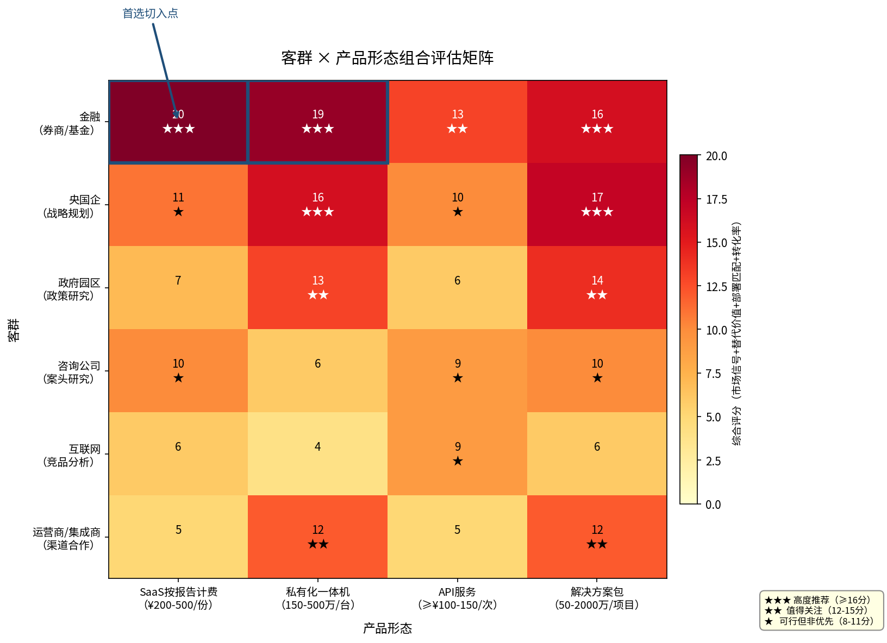

*图：客群与产品形态的综合评估矩阵（评分 = 市场信号 + 替代价值 + 部署匹配 + 转化率），蓝色边框标注首选切入点组合*

这一组合的核心支撑逻辑如下：

- **市场信号最强：** 2025 年金融大模型中标项目量同比 +341%、金额同比 +527%，应用类项目金额集中在 30–150 万元 [中国经营报/艾瑞咨询](https://news.qq.com/rain/a/20260209A03D5G00 "金融大模型招投标分析，2026年2月")；2025 年中国金融智能体投资规模 9.5 亿元，预计 2030 年达 193 亿元（CAGR 82.6%）[艾瑞咨询](https://news.qq.com/rain/a/20260209A03D5G00 "中国金融智能体发展研究报告")。
- **替代价值最直观：** 人工研报 ¥2–5 万/份 vs AI 报告 ¥200–500/份，成本比约 1:100，无需复杂 ROI 计算即可向决策者证明价值。
- **部署需求匹配：** 金融行业 91% 本地化部署需求与一体机产品形态高度契合，一体机从验证到部署的升级路径天然通畅。
- **试点转化率高：** 银行保险业 AI Agent 试点转化率 58%、生产率 47% 均为各行业最高 [Digital Applied](https://www.digitalapplied.com/blog/ai-agent-adoption-2026-enterprise-data-points "AI Agent采用率数据")，首单成功率有数据支撑。
- **投资回收期可控：** 数据分析类 AI Agent 回收期 5.8 个月、金融运营类 8.9 个月 [Digital Applied](https://www.digitalapplied.com/blog/ai-agent-adoption-2026-enterprise-data-points "ROI分布数据")，6 个月窗口内可完成验证闭环。

### 7.1.3 为何不是其他组合

**为何不首选央国企？** 央国企需求强度高、预算确定性高，但决策链路过长（3–5 层审批，销售周期 170–270+ 天 [HumanR.ai](https://www.humanr.ai/intelligence/b2b-tech-sales-cycle-benchmarks-by-deal-size "B2B销售周期基准")），6 个月窗口内难以完成首单闭环。央国企应作为第二波目标，在金融验证成功后通过渠道合作切入。

**为何不首选咨询公司？** 咨询公司案头研究需求强烈，但行业规模有限且付费习惯偏向"人头计费"而非"结果计费"，与按报告计费模式存在结构性摩擦。更关键的是，咨询公司视 AI 为竞争对手的顾虑更深，内部推行阻力大。

**为何不首选运营商/集成商渠道优先？** 渠道激活率 ≥ 40% 的前提是产品已通过市场验证 [Scalarly](https://scalarly.com/blog/channel-strategy-direct-sales-vs-partner-channels/ "Channel Strategy, 2026年1月")。在无标杆案例的情况下贸然启动渠道合作，失败概率极高。渠道应在直销验证成功后启动。

## 7.2 实施路线图：六个月关键里程碑

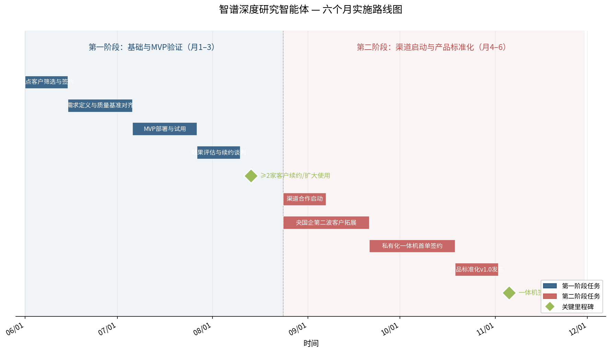

*图：六个月实施路线图甘特图，蓝色为第一阶段（月 1–3），红色为第二阶段（月 4–6），绿色菱形为关键里程碑*

路线图分为三个阶段，遵循"直销验证 → 渠道扩展 → 规模复制"的递进逻辑，参考企业 AI 实施五阶段模型 [Neontri](https://neontri.com/blog/enterprise-ai-roadmap/ "Enterprise AI Roadmap 2026") 进行裁剪适配。

### 7.2.1 第一阶段：基础与 MVP 验证（月 1–3）

**核心目标：** 完成 3–5 家金融机构的 MVP 试点，积累至少 2 个可对外展示的标杆案例，验证产品价值假设与付费意愿假设。

**关键里程碑：**

| 时间 | 里程碑 | 成功标准 |
|------|--------|----------|
| 月 1 周 1–2 | 试点客户筛选与签约 | 锁定 3–5 家金融机构（券商/基金为主），客户满足 Phase 0 筛选标准：已有明确研究产出流程、愿意提供历史课题对比、决策链路 ≤ 3 层、指定命名负责人 |
| 月 1 周 3–月 2 周 2 | 需求定义与质量基准对齐 | 完成客户访谈，确定 2–3 个报告类型，共同定义质量评估标准，设定量化 KPI（如案头研究人力减少 60%、报告引用有效率 ≥ 80%） |
| 月 2 周 3–月 3 周 2 | MVP 部署与试用 | SaaS 模式按报告计费部署，客户使用深度研究智能体完成 3–5 份试点报告 |
| 月 3 周 3–4 | 效果评估与续约谈判 | 量化对比 AI 报告与人工报告质量，确认 ROI，完成 ≥ 2 家客户续约或扩大使用范围 |

**资源投入：**

- 产品与工程团队：2–3 人（智能体配置与客户定制适配）
- 交付与客户成功：2–3 人（客户对接、质量评估、反馈迭代）
- 销售：1–2 人（试点续约谈判与新客户拓展）
- 预算：以人力成本为主，推理成本按试点报告数量估算约 ¥1–2 万（50–100 份 × ¥50–80/份的推理成本）

**关键风险与对策：**

- **风险 1：客户对 AI 报告质量不满意。** 对策：试点期允许人工修订 AI 初稿，以"AI 初稿 + 人工精修"模式降低客户期望落差，逐步提升 AI 自主完成率。
- **风险 2：客户不愿为 AI 报告单独付费。** 对策：以"节省的人工工时"作为计费锚点——若 AI 报告替代 3 个工作日的案头研究，按研究员日薪 ¥2000–3000 计，节省 ¥6000–9000，收费 ¥500–2000 仅为节省成本的 1/4–1/3。
- **风险 3：试点周期过长。** 对策：严格执行 90 天框架 [Fracto](https://www.fracto.ie/blog-posts/ai-pilot-to-production-90-day-enterprise-framework "90-Day AI Pilot Framework")，Phase 1 不超过 3 周，超时未完成需求定义的客户主动放弃。

### 7.2.2 第二阶段：渠道启动与产品标准化（月 4–6）

**核心目标：** 基于第一阶段验证结果，启动运营商/集成商渠道合作，同时推进产品标准化以降低交付边际成本。

**关键里程碑：**

| 时间 | 里程碑 | 成功标准 |
|------|--------|----------|
| 月 4 周 1–2 | 渠道合作启动 | 与神州数码（领航级合作伙伴 [东方财富/雪球](https://guba.eastmoney.com/news,834261,1670121226.html "神州数码领航级合作")）或运营商签订渠道合作协议，明确产品白标/联合方案/OEM 授权模式 |
| 月 4–5 | 央国企第二波客户拓展 | 通过渠道合作伙伴触达 5–10 家央国企/政府园区，以"政策研究""战略规划"场景切入 |
| 月 5–6 | 私有化一体机首单签约 | 依靠金融试点案例背书，完成 1–2 台一体机签约（150–500 万/台），验证高客单价产品形态 |
| 月 6 | 产品标准化 v1.0 发布 | 将试点期间积累的行业模板、质量评估框架、交付流程固化为标准化产品包，将新客户交付周期从试点期的 4–6 周压缩至 2–3 周 |

**资源投入：**

- 新增渠道与合作伙伴经理：1–2 人
- 产品标准化团队：2–3 人（行业模板开发、交付流程 SOP、质量评估自动化）
- 私有化部署工程团队：2–3 人（一体机方案设计、信创适配、客户现场部署）
- 销售：3–4 人（直销续约 + 渠道赋能双线推进）

**关键风险与对策：**

- **风险 1：渠道合作伙伴推不动。** 对策：提供完整的销售工具包（客户案例、ROI 计算器、演示环境），降低合作伙伴的销售门槛；渠道激活 90 天内首单率需 ≥ 40% [Scalarly](https://scalarly.com/blog/channel-strategy-direct-sales-vs-partner-channels/ "Channel Strategy, 2026年1月")，低于此阈值则调整渠道策略。
- **风险 2：一体机部署周期过长。** 对策：一体机方案采用"预配置 + 现场调优"模式，出厂前完成 80% 配置，现场仅需 2–3 天调优。金智维 Ki-AgentS 服务 1500+ 政企客户、部署 180 万+ AI 数字员工 [金智维官网](https://www.kingsware.cn/about "金智维企业介绍")，其规模化部署经验表明预配置策略可将交付周期压缩至可控范围。

### 7.2.3 第三阶段展望：规模化复制（月 7–12，路线图延伸）

第三阶段不在 6 个月窗口的执行范围内，但需提前规划方向，确保第一、二阶段的决策为规模化复制留出空间。

**规模化复制的核心前提：**

1. **标杆案例库 ≥ 5 个：** 金融 2–3 个 + 央国企 1–2 个 + 政府或咨询 1 个，形成跨行业覆盖。
2. **产品标准化程度 ≥ 80%：** 新客户交付无需深度定制，80% 功能开箱即用，20% 行业适配由配置而非开发完成。
3. **渠道合作伙伴 ≥ 3 家：** 至少 1 家运营商级 + 1 家集成商级 + 1 家行业 ISV，渠道收入占比 ≥ 30%。
4. **交付团队可复制：** 单个客户交付人力投入从试点期的 3–5 人·月降至 1–2 人·月。

**规模化复制的商业模式目标（月 12 参考基准）：**

| 指标 | 目标值 | 依据 |
|------|--------|------|
| SaaS 按报告计费客户 | 20–30 家 | 以金融为主，渗透头部与中型券商/基金 |
| 私有化一体机签约 | 5–10 台 | 金融 + 央国企，单台 150–500 万 |
| 渠道合作收入 | 占总收入 20–30% | 通过运营商/集成商触达长尾客户 |
| 综合毛利率 | ≥ 55% | SaaS 60–70% + 一体机纯软件 70–80% + 解决方案 30–50% 加权 |
| ARR（年化经常性收入） | 3000–5000 万元 | 参考 Sierra AI 7 季度达 1 亿美元 ARR 的路径 [Contrary Research](https://research.contrary.com/company/sierra "Sierra商业拆解，2026年4月")，但考虑中国市场与起步规模差异，12 个月 ARR 目标设定为 Sierra 同期的 5%–10% |

## 7.3 资源分配与优先级取舍

### 7.3.1 六个月资源分配原则

智谱本地化部署营业成本中人工成本占 54.4% [虎嗅](https://www.huxiu.com/article/4820128.html "智谱AI成本结构拆解")，交付能力是核心瓶颈而非技术能力。6 个月资源分配的核心原则因此确立为：**交付能力 > 销售扩张 > 产品研发**。

具体分配建议：

| 投入方向 | 占比 | 说明 |
|----------|------|------|
| 交付与客户成功 | 40% | 试点部署、质量评估、客户反馈迭代、标准化交付流程建设 |
| 销售与渠道 | 30% | 直销团队扩充、渠道合作伙伴管理、销售工具包开发 |
| 产品工程 | 20% | 行业模板开发、一体机方案设计、信创适配、质量评估自动化 |
| 市场与品牌 | 10% | 案例包装、行业活动、DRB 排名传播 |

### 7.3.2 必须放弃的选项

在资源有限条件下，以下方向在 6 个月窗口内应明确放弃：

- **互联网战略/产品团队直销：** 付费意愿弱、Chatbot 免费化趋势下付费习惯难建立 [亿欧智库](https://www.iyiou.com/research/202601201649 "2025全球人工智能技术应用洞察报告")，投入产出比不及金融与央国企。
- **API 服务独立商业化：** 单次调用 ≥ ¥100–150 的定价在竞品 ¥2.5/次的锚定效应下极难获客 [百度千帆社区](https://qianfan.cloud.baidu.com/qianfandev/topic/687830 "千帆定价")，API 服务应作为私有化部署的附加组件而非独立产品。
- **多行业同步拓展：** 6 个月内同时切入金融、央国企、政府、咨询会导致交付资源分散，每个行业均无法做深。应聚焦金融直销 + 渠道触达央国企的双轨模式。
- **DRB II 成绩提交与营销：** 智谱暂未提交 DRB II 成绩 [DRB II 官网](https://agentresearchlab.com/benchmarks/deepresearch-bench-ii/index.html "DRB II 排行榜")，短期内提交并营销的 ROI 不如聚焦客户交付。DRB I #1 的品牌资产已足够支撑首波销售。

## 7.4 成功的度量体系

### 7.4.1 北极星指标

AI Agent 成功试点的共享特征高度一致：94% 有命名 Agent 负责人且有预算权限、87% 每次 prompt 变更前运行自动评估、81% 将 Agent 限定在单一工作流且有二元成功标准 [Digital Applied](https://www.digitalapplied.com/blog/ai-agent-adoption-2026-enterprise-data-points "AI Agent采用率数据")。参照这一规律，智谱深度研究智能体的北极星指标确立为：

> **试点客户 6 个月续约率 ≥ 50%**

该指标直接衡量客户是否从产品中获得了持续价值。若续约率低于 50%，意味着产品价值假设未通过验证，应回退至产品迭代阶段而非推进规模化。

### 7.4.2 阶段性度量

| 阶段 | 度量指标 | 目标值 |
|------|----------|--------|
| 月 1–3 试点期 | 试点客户签约数 | 3–5 家 |
| 月 1–3 试点期 | 试点报告完成数 | ≥ 50 份 |
| 月 1–3 试点期 | 客户报告引用有效率 | ≥ 80% |
| 月 1–3 试点期 | 案头研究人力投入减少比例 | ≥ 50% |
| 月 4–6 扩展期 | 试点客户续约/扩大使用率 | ≥ 50% |
| 月 4–6 扩展期 | 渠道合作伙伴首单激活率 | ≥ 40% |
| 月 4–6 扩展期 | 私有化一体机签约 | ≥ 1 台 |
| 月 4–6 扩展期 | 新客户交付周期 | ≤ 3 周 |
| 月 6 终点 | 累计签约客户（含试点续约） | ≥ 8 家 |
| 月 6 终点 | 累计报告交付量 | ≥ 200 份 |
| 月 6 终点 | ARR（年化） | ≥ 500 万元 |

## 7.5 从技术成果到政企解决方案的转化路径

### 7.5.1 转化的三道关卡

智谱深度研究智能体从"技术成果"到"政企解决方案"需跨越三道关卡：

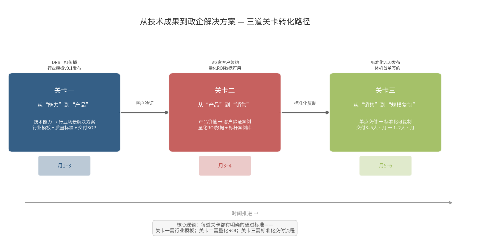

*图：能力→产品→销售→规模化复制的三道关卡转化路径，每道关卡标注关键通过标准与时间节点*

**关卡一：从"能力"到"产品"。** DRB I #1 是技术能力的证明，但政企客户购买的并非排行榜分数，而是"谁能解决具体问题"。转化方式：将技术能力封装为行业场景解决方案——"券商行业深度研报生成""央企战略规划政策研究""政府产业图谱分析"等，每个方案包含行业模板、质量评估标准、交付流程 SOP。

**关卡二：从"产品"到"销售"。** 产品价值需要通过客户验证才能转化为可销售案例。转化方式：首波 3–5 家试点客户即是最重要的销售资产——不仅是案例故事，更是量化 ROI 数据。Harvey AI 凭借 1300 个组织、10 万+律师的使用数据支撑 110 亿美元估值 [CNBC](https://www.cnbc.com/2026/03/25/legal-ai-startup-harvey-raises-200-million-at-11-billion-valuation.html "Harvey融资与商业数据，2026年3月")，印证了"客户数据即估值"的逻辑。

**关卡三：从"销售"到"规模化复制"。** 单个客户交付成功不等于规模化能力。转化方式：将交付经验固化为标准化流程，将行业适配从"定制开发"转为"配置组合"，将交付人力投入从 3–5 人·月降至 1–2 人·月。智谱北方交付中心的核心使命正在于此——从"按项目定制交付"向"标准化产品 + 可配置交付"转型 [36氪](https://m.36kr.com/p/3628998562776324 "智谱从定制化向标准化转型")。

### 7.5.2 转化路径的时间线

| 时间 | 转化状态 | 标志性事件 |
|------|----------|-----------|
| 月 1 | 能力验证期 | DRB I #1 成绩对外传播，试点客户签约 |
| 月 2–3 | 产品封装期 | 行业模板 v0.1 发布，试点报告交付，质量基准对齐 |
| 月 3–4 | 案例积累期 | ≥ 2 家客户续约，量化 ROI 数据可用，案例材料完成 |
| 月 4–5 | 渠道启动期 | 渠道合作协议签订，销售工具包交付合作伙伴 |
| 月 5–6 | 规模化准备期 | 产品标准化 v1.0 发布，一体机首单签约，交付流程 SOP 定稿 |

## 7.6 本章结论与推荐

综合全部分析，智谱北方交付中心商业化落地的最终建议如下：

**首选切入点：** 金融行业投研报告场景，以 SaaS 按报告计费（¥200–500/份）为验证形态，以私有化一体机（150–500 万/台）为利润形态。这一组合在市场需求信号、替代价值直观性、部署需求匹配度、试点转化率、投资回收期五个维度上均为最优。

**时序策略：** 月 1–3 直销 MVP 验证，月 4–6 验证成功后启动渠道合作。双轨并行但时序侧重，避免在产品未验证时消耗渠道信用。

**六个月关键目标：** 3–5 家金融试点客户完成验证，≥ 2 家续约或扩大使用，1 台一体机签约，渠道合作启动，产品标准化 v1.0 发布，ARR 达 500 万元以上。

**资源分配原则：** 交付能力优先于销售扩张，销售扩张优先于产品研发。放弃互联网直销、API 独立商业化、多行业同步拓展。

**北极星指标：** 试点客户 6 个月续约率 ≥ 50%。低于此阈值则回退至产品迭代，不推进规模化。

上述路径的核心假设是：金融行业对万字级深度研究报告的 AI 替代需求真实存在且愿意付费。若该假设在 3 个月 MVP 验证中被证伪——客户认为 AI 报告质量不足以替代人工，或不愿为 AI 报告单独付费——则需回退至假设检验阶段，重新评估产品定位与目标客群。但基于当前数据——金融 Agent 试点转化率 58%、人工研报成本 ¥2–5 万/份、91% 本地化部署需求——该假设成立的概率较高，值得全力投入验证。

# 结论

本报告围绕智谱深度研究智能体的商业化落地，完成了从产品定位到实施路线图的完整论证。核心结论可收敛为以下五条：

**智谱深度研究智能体不是"会写长报告的 ChatGPT"，而是端到端研究交付引擎。** DRB I 排行榜第一名（57.06 分）量化了它与通用问答工具的质变差距——有效引用数 31–111 条（vs LLM with Search 的 4–33 条）、RACE 得分 47–49 分（vs 35–41 分）。Plan-Write 两阶段架构、Rumination 递归推理引擎和真实浏览器交互能力，使其执行的是"规划-检索-验证-综合-输出"的多轮闭环，而非单轮检索拼接。约 2 小时的端到端耗时是深度投资的体现，而非效率劣势。

**金融行业投研报告场景是商业化的唯一首选切入点。** 六维过滤（定位边界 → 客群优先级 → 场景价值 → 竞品壁垒 → 商业模式可行性 → 销售与试点策略）收敛至同一结论：金融行业在需求强度、付费意愿、试点转化率、投资回收期四个关键指标上均为最优，人工研报 2–5 万元/份的成本锚点使 AI 替代价值无需复杂论证即可被决策者感知。央国企、政府园区、咨询公司、运营商/集成商、互联网团队依次排序为 P1–P3 优先级，应作为第二波目标而非首战方向。

**差异化壁垒的核心是"品类重定义"，而非"参数量比拼"。** 智谱在 DRB I 前五名分差仅 1.02 分的格局下，技术领先本身不足以构成持久护城河。三层递进壁垒——准入壁垒（私有化部署 + 信创适配将 OpenAI、华为小艺、百度千帆排除在金融和政务候选清单之外）、能力壁垒（DRB I #1 + 端到端闭环 + 中文信息源深度覆盖）、场景壁垒（万字级定位 + 研究工作流嵌入提升替换成本）——的构建方向，决定了商业化推进的战略重点应在第二、三层壁垒的持续加固上，而非仅依赖第一层准入优势。

**商业模式的正确路径是 RaaS（结果即服务），而非传统 SaaS 订阅。** 单份报告推理成本 50–80 元决定了按人头订阅无法覆盖可变成本。按报告计费（200–500 元/份）是验证期形态，毛利率 60–70%；私有化一体机（150–500 万元/台）是利润引擎，纯软件授权毛利率 70–80%；渠道 OEM/联合方案是规模杠杆。三阶段演进——验证 → 部署 → 规模化——与客户决策周期和产品标准化程度同步推进。

**六个月实施路线图的关键节点：月 1–3 完成 3–5 家金融机构 MVP 试点，月 4–6 启动渠道合作并完成一体机首单签约，月 6 ARR 达 500 万元以上。** 北极星指标为试点客户 6 个月续约率 ≥ 50%，低于此阈值则回退至产品迭代而非推进规模化。资源分配遵循"交付能力 > 销售扩张 > 产品研发"原则，放弃互联网直销、API 独立商业化和多行业同步拓展。

这些建议的成立依赖于一个核心假设：金融行业对万字级深度研究报告的 AI 替代需求真实存在且愿意付费。当前数据——金融 Agent 试点转化率 58%、人工研报成本 2–5 万元/份、91% 本地化部署需求——支撑该假设成立的概率较高。但 3 个月 MVP 验证的结果将最终判定路径走向：若假设成立，则加速推进；若假设被证伪，则需回退至产品定位与目标客群的重新评估。智谱北方交付中心的使命，正是在这一验证-迭代-扩展的循环中，将深度研究智能体从技术成果转化为可规模化交付的政企解决方案。
